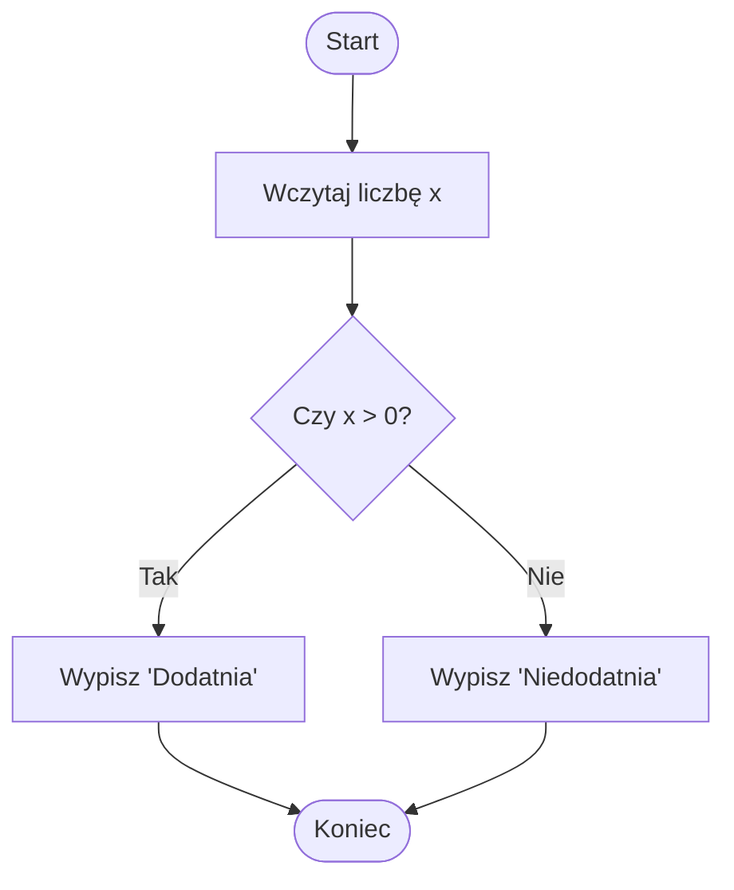
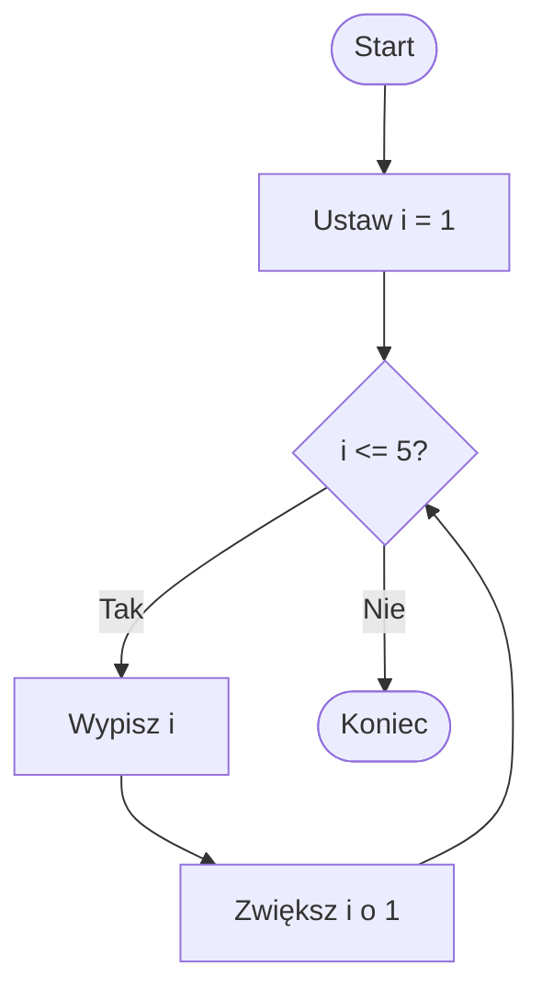

# Recap – Lab 1

  

Na pierwszym laboratorium zapoznaliśmy się z podstawami programowania w Pythonie.

Dowiedzieliśmy się, czym jest **programowanie** – proces tworzenia programu komputerowego, który wykonuje zadania określone w **kodzie źródłowym**.

  

Pierwszym poznanym poleceniem była funkcja `print()`, która służy do wyświetlania komunikatów na ekranie.

```python
print("Hello World!")
```
Powyższy kod wypisze na ekranie: `Hello World!`.

Omówiliśmy pojęcie **zmiennych** i typów danych. Zmienna to nazwana przestrzeń w pamięci, w której można przechowywać dane różnego typu, np. liczby całkowite (`int`), liczby zmiennoprzecinkowe (`float`), napisy (`str`) czy wartości logiczne (`bool`).

```python
a = 10 # int
b = "tekst" # str
c = 3.14 # float
d = True # bool
```

Poznaliśmy **konwersję typów danych** przy użyciu funkcji `int()`, `float()` i `str()`.

```python
wiek = int(input("Podaj swój wiek: "))
```

Tutaj wczytujemy dane od użytkownika (zawsze jako tekst) i konwertujemy je na liczbę całkowitą.

Wprowadziliśmy także **operatory arytmetyczne** (`+`, `-`, `*`, `/`, `//`, `%`, `**`) i omówiliśmy kolejność wykonywania działań.

```python
print((3 - 5) * 2) # Wynik: -4
```

Kolejnym tematem były **instrukcje warunkowe**, które pozwalają na podejmowanie decyzji w kodzie.

```python
if wiek < 18:
	print("Niepełnoletni")
else:
	print("Pełnoletni")
```

Na koniec poznaliśmy podstawowe algorytmy do samodzielnego rozwiązania – sprawdzanie znaku liczby, porównywanie dwóch wartości czy wypisywanie liczb w pętli (na razie te pętle były omówione teoretycznie).

Pierwsze laboratorium zakończyliśmy kilkoma prostymi zadaniami praktycznymi, w których wykorzystaliśmy `input()`, zmienne i instrukcje `if`.

# Pętle

Na poprzednim spotkaniu omówiliśmy sobie instrukcje warunkowe - z jednego rombu sprawdzającego pełnienie warunku mogliśmy przejść w jedną z dwóch dróg - True albo False. Jednakże, każda z tych dróg prowadziła nas dalej w kierunku znacznika końca programu



Ale tak naprawdę nie ma żadnej zasady mówiącej, że w wykonaniu programu zawsze trzeba poruszać się ze strzałkami w kierunku końca. W pełni dopuszczalne jest cofnięcie się o kilka instrukcji i wykonanie jednego bloku instrukcji nie jeden a 5, 7, 100 czy nawet ∞ razy. Na poniższym diagramie możemy to bardzo dobrze zobaczyć:



W tym programie, jeśli `i<=5` zawsze dokonamy:
- wydrukowania `i`
- zwiększenia `i` o 1

i ten zestaw instrukcji będziemy wykonywać wielokrotnie, tak długo, aż warunek `i <= 5` stanie się `False` - czyli `i > 5`. Ten koncept nazywamy **pętlą** - powód jest dość prosty, wystarczy spojrzeć na powyższy diagram i narysowaną na nim **pętlę** - wychodzący z bloku sprawdzającego warunek i wracający do niego przepływ działania programu.

```python
i = 1  # Ustaw i = 1
while i <= 5:  # Dopóki i <= 5
    print(i)   # Wypisz i
    i += 1     # Zwiększ i o 1
print("Koniec")  # Koniec programu
```

To w zasadzie tyle, jeśli chodzi o sam koncept pętli - sama idea jest bardzo prosta, ale z punktu widzenia programistycznego jest to potężne narzędzie, którego użycie jest podstawą działania wielu programów
## Pętle while
Co do zasady, w większości języków programowania rozróżniamy dwa rodzaje pętli: `while` oraz `for`. W pętli `while` blok instrukcji będzie wykonywany tak długo, aż podany przy instrukcji condition będzie zwracał `True`. Ważne jest aby pamiętać o tym, że sprawdzana w warunku zmienna musi mieć modyfikowaną wartość, w przeciwnym wypadku stworzymy pętlę nieskończoną, z której program nie wyjdzie, bo nie będzie miał takiej możliwości.

```python
i = 1  
while i < 6:  
	print(i)  
```

Tak jak to robiliśmy na poprzednich zajęciach, wartość zmiennej możemy zmienić w bardzo prosty sposób - na przykład operacja *inkrementacji*, czyli zwiększenia wartości zmiennej o 1 to `a = a + 1`. Jednak są prostsze sposoby na osiągnięcie tego samego celu - w poniższej tabeli znajduje się zestaw wszystkich operatorów służących do przypisania nowej wartości do istniejącej zmiennej korzystając z zapisanej tam wcześniej wartości. 

| **Kategoria**   | **Operator** | **Opis**                          | **Przykład**           |
| --------------- | ------------ | --------------------------------- | ---------------------- |
| **Przypisania** | `=`          | Przypisanie                       | `x = 5`                |
|                 | `+=`         | Dodaj i przypisz                  | `x += 2` (`x = x + 2`) |
|                 | `-=`         | Odejmij i przypisz                | `x -= 2`               |
|                 | `*=`         | Pomnóż i przypisz                 | `x *= 2`               |
|                 | `/=`         | Podziel i przypisz                | `x /= 2`               |
|                 | `//=`        | Dzielenie całkowite i przypisanie | `x //= 2`              |
|                 | `%=`         | Reszta i przypisanie              | `x %= 2`               |
|                 | `**=`        | Potęguj i przypisz                | `x **= 2`              |

Pętle while obsługują 3 dodatkowe *statementy*, które pozwalają na precyzyjne sterowaniem wykonania programu.

### Continue
`continue` pozwala na przerwanie bieżącego wykonania pętli (program nie będzie kończył bieżącego obejścia) i automatyczne przejście do następnego

```python
i = 0
while i < 6:
    i += 1
    if i % 2 == 0:
        continue  # Przejdź do kolejnej iteracji
    print(i)
# Wynik: 1, 3, 5
```

### Break
`break` jest instrukcją, która po dotarciu do niej **natychmiast** zakończy wykonanie pętli

```python
i = 0
while i < 6:
    i += 1
    if i > 3:
        break  # Zatrzymaj pętlę
    print(i)

# Wynik: 1, 2, 3
```

### Else
Z `else` już powinniście być zaznajomieni. W *ifach* służył do zrealizowania wypadku przeciwnego do realizowanej instrukcji. W wypadku pętli koncept jest podobny:

```python
i = 0
while i < 5:
    i += 1
    print(i)
else:
    print("Pętla zakończona bez przerwania!")

# Wynik:
# 1 2 3 4 5
# Pętla zakończona bez przerwania!
```

#### Zadanie na zajęcia 1
Napisz program, który od użytkownika przyjmie liczbę (1-50), a następnie wydrukuje tyle znaków `#` ile podał użytkownik

#### Zadanie na zajęcia 2  
Napisz program, który:  
- zapyta użytkownika o liczbę **N**,  
- wypisze wszystkie liczby od **1** do **N** w jednej linii, używając pętli `while`.

#### Zadanie na zajęcia 3
Napisz program, który:  
- losuje liczbę od **1 do 10**,  
- prosi użytkownika o zgadywanie liczby, aż zgadnie,  
- wyświetla komunikat: „Za mało” lub „Za dużo”, a po trafieniu: „Brawo!”.

---

## Pętla for
W Pythonie pętle `for` służą przede wszystkim do przechodzenia po **zestawie danych**. Do tego zagadnienia w szczególe przejdziemy za chwilę, ale sam koncept pętli `for` jest bardzo prosty.

Zgodnie z definicją pętla `for` służy do **iterowania** po **sekwencji danych**. Najprostszą sekwencją danych jaką poznaliśmy jest *String*. Tak naprawdę jest to po prostu zestaw znaków. Z pętlą `for` możemy wykonać polecenia 1 raz dla każdego z **elementów sekwncji**.

```python
for i in "JICA":
	print(i)
```

Powyższy kawałek kodu wydrukuje nam w oddzielnych liniach liter `J`, `I`, `C`, `A` - każda z tych liter była jednym elementem sekwencji, zgrupowane w typ *String*. 

Typów **zestawów danych** obsługiwanych przez Pythona jest kilka. Jednym z nich, chyba najprostszym do poznania jest **lista**. Jest to sposób na przechowywanie kilku elementów  w ramach jednej zmiennej

```python
owoce = ["Jabłko", "Banan", "Truskawka"]
print(owoce)
```

List możemy używać w pętlach `for` - znów, tak jak przy stringu, dla każdego elementu pętla zostanie wykonana 1 raz

```python
liczby = [1, 2, 3, 4, 5]

for liczba in liczby:
    print(f"Kwadrat liczby {liczba} to {liczba ** 2}")
```

Proste, nie? Zastosowania tych pętli są szerokie, a ich obsługa naprawdę prosta - pętla wykona się tyle razy ile elementów ma podany do niej zakres danych. Jeśli chcielibyśmy wykonać pętlę na szerokim zakresie liczb - na przykład od 1 do 200, to użyć możemy instrukcji `range`.

```python
for i in range(1, 6):
    print("Liczba:", i)
```

`break`, `continue` oraz `else` działają w pętlach `for` dokładnie tak samo, jak w pętli `while`.

## Pętle zagnieżdżone
To jest bardzo prosty w zrozumieniu koncept, aczkolwiek bez wątpienia wymagający przećwiczenia. Tak, jak na wcześniejszych zajęciach umieściliśmy warunek `if` wewnątrz drugiego, tak i w pętlach ten mechanizm jest w pełni dopuszczalny i popularny. Nazywać to będziemy **pętlami zagnieżdżonymi** - brzmi strasznie, ale to po prostu pętla schowana wewnątrz innej pętli.

```python
for i in range(1, 4):         # Pętla zewnętrzna
    for j in range(1, 4):     # Pętla wewnętrzna
        print(i, "*", j, "=", i * j)
    print("---")  # Oddzielenie wyników dla kolejnej liczby
```

#### Zadanie na zajęcia 4: Suma liczb  
Napisz program, który obliczy sumę liczb od 1 do 100 (włącznie) za pomocą pętli `for`.  

---

#### Zadanie na zajęcia 5: Kwadraty liczb  
Napisz program, który wypisze kwadraty wszystkich liczb od 1 do 10 w formie:  
```
1^2 = 1
2^2 = 4
3^2 = 9
...
```

---

#### Zadanie na zajęcia 6: Liczby parzyste i nieparzyste  
Napisz program, który przechodzi przez liczby od 1 do 20 i dla każdej liczby:  
- wypisuje **„parzysta”**, jeśli liczba jest parzysta,  
- wypisuje **„nieparzysta”**, jeśli liczba jest nieparzysta.

## Przechowywanie danych

Python ma 4 specjalne typy danych, pozwalające na przechowywanie **kolekcji** danych różnych typów. Są to:
- Listy (*list*)
- Krotki (*tuple*)
- Zestawy (*set*)
- Słowniki (*dictionary*)
Każdy z tych typów ma swoje określone cechy, odróżniające je od pozostałych, a co za tym idzie każdy z nich będzie miał różne zastosowania.

### Listy
Listy wykorzystywane są do przechowywania wielu elementów w jednej zmiennej. Tworzone są poprzez zamknięcie listy elementów w nawiasach kwadratowych `[]`. 

```python
owoce = ["Jabłko", "Banan", "Truskawka"]
print(owoce)
```

Elementy na liście są umieszczane po kolei, a każdy z nich ma swój indeks. Pierwszy element ma indeks `[0]`, drugi indeks `[1]` i tak dalej. Używając tych indeksów możemy odwoływać się do konkretnego elementu:

```python
owoce = ["Jabłko", "Banan", "Truskawka"]
print(owoce[1]) # Wydrukuje "Banan"
```

Listy są określane jak *changeable*, czyli możemy zmieniać elementy na inne, dodawać i usuwać je już po ich utworzeniu. Ponadto, listy są indeksowane, a co za tym idzie, możemy umieszczać na nich duplikaty

```python 
owoce = ["Jabłko", "Banan", "Banan", "Truskawka"]
```

W powyższym przypadku `owoce[1]` mają tę samą wartość co `owoce[2]`. 

Listy pozwalają na kilka sposobów odnoszenia się do elementów na nich się znajdujących. `owoce[1]` to drugi element listy od lewej strony. `owoce[-1]` to ostatni element na liście, `owoce[-2]` to przedostatni itd. Możemy również skorzystać z opcji *zakresowych* - 
```python
owoce = ["Jabłko", "Banan", "Truskawka"]
print(owoce[1:2]) # Wydrukuje "Jabłko Banan"
```

Poza tym, elementy na liście możemy traktować jako zwykłe zmienne, więc w pełni dopuszczalne jest na przykład nadpisanie jakiejś wartości z listy

```python
owoce = ["Jabłko", "Banan", "Truskawka"]  
owoce[1] = "Arbuz"  
print(owoce[1]) # Wydrukuje "Arbuz"
```

Listy pozwalają na dodawanie do nich elementów. Realizujemy to poprzez funkcję `append()`:

```python
owoce = ["Jabłko", "Banan", "Truskawka"]  
print(owoce) # Wydrukuje "Arbuz"  
owoce.append("Arbuz")  
print(owoce) # Wydrukuje "Arbuz"
```

Listy możemy również sortować - do tego posłuży funkcja `sort()`

```python
owoce = ["Jabłko", "Banan", "Truskawka"]  
owoce.sort()  
print(owoce) # Wydrukuje w kolejności alfabetycznej
```

### Tuple
Tuple to specyficzny rodzaj listy. Listy traktujemy jako element żywy, który możemy stale zmieniać, poprawiać, dopasowywać, zmiejszać. Tupla od utworzenia do końca programu będzie miała stałą formę - jest tylko do odczytu. Nadal możemy, podobnie jak w wypadku list odnosić się do kolejnych jej elementów, ale nie mamy opcji modyfikacji tego, co się w danej tupli znajduje

Tuple definiujemy poprzez użycie nawiasów okrągłych `()` okalających zestaw danych.

```python
owoce = ["Jabłko", "Banan", "Truskawka"] # Lista
owoce = ("Jabłko", "Banan", "Truskawka") # Tupla
```

```python
# Tworzenie tupli
tupla = (1, 2, 3, 4)
print("Zawartość tupli:", tupla)

# Tupla może zawierać różne typy danych
mieszana = (1, "tekst", 3.14, True)
print("Mieszana tupla:", mieszana)

# Dostęp do elementów (indeksowanie)
print("Pierwszy element tupli:", tupla[0])
print("Ostatni element tupli:", tupla[-1])

# Slicing (wycinanie fragmentów)
print("Elementy od 1 do 3:", tupla[1:3])

# Zagnieżdżone tuple
zagniezdzona = (1, (2, 3), 4)
print("Drugi element zagnieżdżonej tupli:", zagniezdzona[1])

# Konkatenacja i powtarzanie tupli
tupla1 = (1, 2)
tupla2 = (3, 4)
print("Połączone tuple:", tupla1 + tupla2)
print("Powtórzona tupla:", tupla1 * 3)

# Funkcje pomocnicze
print("Długość tupli:", len(tupla))
print("Ile razy występuje 2 w tupli:", tupla.count(2))
print("Indeks elementu 3 w tupli:", tupla.index(3))

# Konwersja listy na tuplę
lista = [5, 6, 7]
tupla_z_listy = tuple(lista)
print("Lista jako tupla:", tupla_z_listy)

# Iterowanie po tupli
print("Elementy w tupli:")
for element in tupla:
    print(element)
```
## Set
*Sety* to inny, charakterystyczny zestaw danych. Sety są *unordered*, *unchangeable*, a na dodatek nie pozwalają na przechowywanie duplikatów. Z Setami jest tak, że nigdy nie możemy mieć pewności, w jakiej kolejności dane zostaną nam zwrócone - nie taki jest ich cel. Kiedyś usłyszałem określenie, że w Pythonie *Set* to taki odpowiednik tej jednej szuflady, którą każdy z nas ma w domu - radosny śmietnik, w którym obok 3 ładowarek leży stara lalka, widelec turystyczny, 8 śrubek i pamiątka z Zakopanego z 2006 roku. W setach możemy sprawdzić, czy coś się w nim znajduje, ale nie możemy poznać, gdzie ten element dokładnie jest. Możemy również dodawać do setów elementy oraz je usuwać.

```python
# Tworzenie setów
owoce = {"jabłko", "banan", "gruszka"}
print("Zawartość zbioru:", owoce)

# Dodawanie elementów
owoce.add("śliwka")
print("Po dodaniu śliwki:", owoce)

# Usuwanie elementów
owoce.remove("banan")  # Jeśli elementu nie ma, wystąpi błąd
print("Po usunięciu banana:", owoce)

owoce.discard("pomarańcza")  # Bez błędu, nawet jeśli element nie istnieje
print("Po próbie usunięcia pomarańczy:", owoce)

# Sprawdzanie, czy element istnieje
print("Czy gruszka jest w zbiorze?", "gruszka" in owoce)

# Operacje na setach
A = {1, 2, 3, 4}
B = {3, 4, 5, 6}

print("A ∪ B (suma):", A | B)
print("A ∩ B (część wspólna):", A & B)
print("A - B (różnica):", A - B)
print("A Δ B (różnica symetryczna):", A ^ B)

# Tworzenie setu z listy (usuwa duplikaty)
lista = [1, 2, 2, 3, 3, 3]
unikalne = set(lista)
print("Unikalne elementy listy:", unikalne)

# Iterowanie po secie
print("Elementy w zbiorze owoce:")
for owoc in owoce:
    print(owoc)

```

#### Zadanie na zajęcia 7: Lista – średnia ocen  
Napisz program, który:  
- wczyta od użytkownika 5 ocen (liczb całkowitych) i zapisze je do listy,  
- obliczy średnią ocen,  
- wypisze komunikat „Zaliczone”, jeśli średnia jest większa lub równa 3.0, w przeciwnym razie „Nie zaliczone”.

---

#### Zadanie na zajęcia 8: Tupla – analiza punktów  
Napisz program, który:  
- ma zdefiniowaną tuplę z 10 wynikami egzaminów (liczby od 0 do 100),  
- wypisze liczbę ocen powyżej 50,  
- wypisze największy i najmniejszy wynik.

---

#### Zadanie na zajęcia 9: Set – słownik unikalnych słów  
Napisz program, który:  
- wczyta od użytkownika zdanie (jako tekst),  
- podzieli je na słowa i umieści w zbiorze (set),  
- wypisze wszystkie unikalne słowa oraz informację, ile ich jest,  
- jeśli w zdaniu pojawia się słowo „Python”, wypisze komunikat: „Świetnie, znasz Pythona!”.
