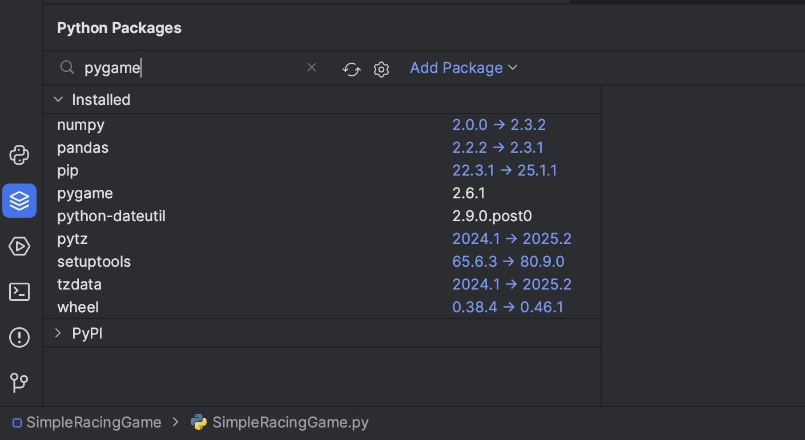
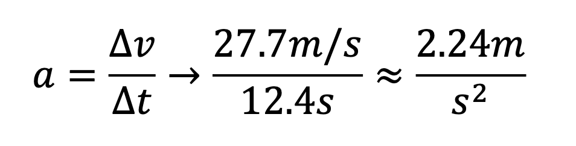
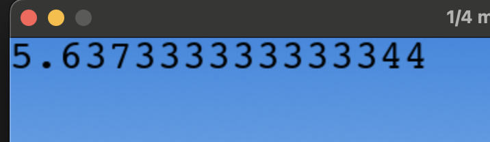
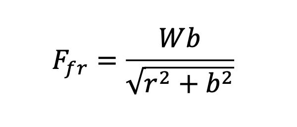
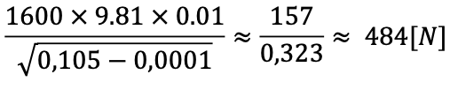
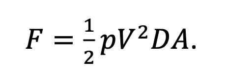
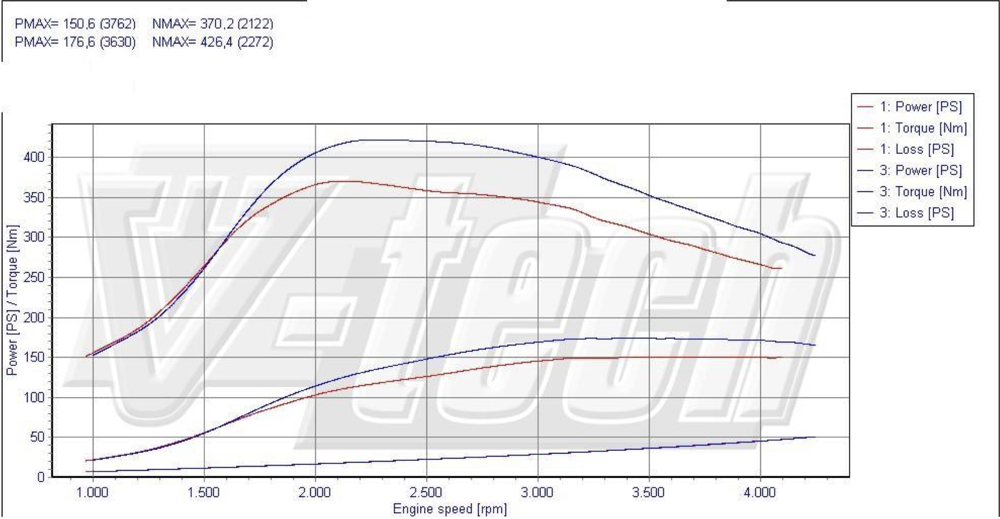

Dzisiaj będziemy pracować nad odrobinę większym projektem, wprowadzimy też tematykę zewnętrznych bibliotek w pythonie. Szkielet projektu do pobrania [**tutaj**](../assets/JICA/SimpleRacingGame.zip)

### Biblioteki
Biblioteki w Pythonie to **zestawy gotowych narzędzi** (funkcji, klas, modułów), które ktoś już napisał, aby ułatwić Ci pracę. Dzięki nim nie musimy tworzyć wszystkiego od zera. Dzisiaj będziemy korzystali z biblioteki `pygame`, ale bibliotek do pythona jest od groma, poznamy ich jeszcze kilka.

### Przykład z życia:
Wyobraź sobie, że chcesz zbudować dom. Możesz:
- Wytworzyć **każdy klocek samodzielnie** (trwa wieki),
- Albo **pójść do sklepu budowlanego** i kupić gotowe cegły, okna, drzwi – i od razu budować.

Biblioteki w Pythonie są jak ten **sklep z gotowymi częściami** - ktoś je przygotował, a my jedynie z nich korzystamy.

Python ma zestaw wbudownych bibliotek:
```python
import math
print(math.sqrt(16))  # Wynik: 4.0
```

Ale my będziemy korzystali z biblioteki, która nie jest dostarczana razem z pythonem - biblioteką tą będzie `pygame`. Aby ją zainstalować należy wykonać polecenie 

```bash
pip install pygame
```

W terminalu. Alternatywnie można skorzystać z wbudowangeo w PyCharma modułu zarządzania bibliotekami 

## Aplikacja
Nasz dzisiejszy projekt, to prosta gra symulująca silnik i skrzynię biegów samochodu - poza nauką programowania będzie dzisiaj trochę fizyki, a przy okazji może niektórzy dowiedzą się jak działa samochód. Zaczniemy od pobrania szablonu projektu, uruchomienia i przeanalizowania istniejącego kodu.

Pygame to biblioteka w Pythonie do tworzenia **gier 2D i prostych animacji**. Pozwala rysować grafiki, wyświetlać tekst, odtwarzać dźwięki i reagować na klawiaturę czy myszkę.
## Omówienie kodu linia po linii:

### 1. Import bibliotek
```python
import pygame
import os
```
- `pygame` – biblioteka do gier.  
- `os` – wbudowana biblioteka Pythona, która pomaga np. tworzyć ścieżki do plików (tak żeby działały na Windowsie i Linuxie).

### 2. Ustawienia gry
```python
WIDTH = 720
HEIGHT = 480
METER = 16
FPS = 60
```
- **WIDTH i HEIGHT** – rozmiar okna gry (szerokość i wysokość w pikselach).  
- **METER** – wygląda na skalę lub jednostkę (1 „metr” = 16 pikseli, przydatne np. do obliczeń).  
- **FPS** – klatki na sekundę (ile razy na sekundę ekran będzie odświeżany).  

### 3. Inicjalizacja Pygame
```python
pygame.init()
pygame.font.init()
```
- **pygame.init()** – uruchamia wszystkie podstawowe moduły Pygame (grafika, dźwięk, czas).  
- **pygame.font.init()** – włącza obsługę czcionek (żeby można było rysować tekst na ekranie).

### 4. Czcionka do wyświetlania tekstu
```python
myfont = pygame.font.SysFont('Lucida Console', 30)
```
- Tworzy czcionkę systemową o nazwie „Lucida Console”, rozmiar 30 pikseli.  
- Później można jej używać, żeby np. wyświetlić na ekranie napis „START!”.

### 5. Zegar gry
```python
clock = pygame.time.Clock()
```
- Tworzy „zegar” do kontrolowania prędkości gry (np. żeby gra działała zawsze w 60 FPS, niezależnie od mocy komputera).

### 6. Wczytywanie obrazków
```python
background1 = pygame.image.load(os.path.join('Assets', 'background1.png'))
background2 = pygame.image.load(os.path.join('Assets', 'background2.png'))
background3 = pygame.image.load(os.path.join('Assets', 'sky.png'))
vehicle = pygame.image.load(os.path.join('Assets', 'vehicle.png'))
```
- Wczytuje obrazki z folderu `Assets` (np. tło gry i pojazd).  
- `os.path.join('Assets', 'background1.png')` tworzy ścieżkę do pliku w bezpieczny sposób (działa na różnych systemach).

### 7. Prostokąty (pozycje i rozmiary obrazków)
```python
bgrect1 = background1.get_rect()
bgrect2 = background2.get_rect()
bgrect3 = background3.get_rect()
vehiclerect = vehicle.get_rect()
```
- Każdy obrazek ma swój **prostokąt** (ang. `rect`), który zawiera:
  - jego pozycję (x, y na ekranie),
  - jego rozmiar (szerokość i wysokość).
- Dzięki temu łatwo można przesuwać lub wykrywać kolizje obiektów (np. czy pojazd dotknął przeszkody).

### 8. Tworzenie okna gry
```python
WIN = pygame.display.set_mode((WIDTH, HEIGHT))
```
- Tworzy **okno gry** o wielkości 720x480 pikseli.  
- Wszystkie obrazki i teksty będą rysowane właśnie na tym oknie.

### 9. Ustawienie tytułu okna
```python
pygame.display.set_caption("1/4 mile race")
```
- Nadaje oknu gry tytuł, który zobaczysz na pasku u góry (np. w Windowsie).

To wszystko to *setup* naszego projektu. Przygotowujemy go w ten sposób do działania, ustawiamy jeszcze przed zasadniczym uruchomieniem gry wszystkie aspekty programu.


## Wyświetlanie

Poniżej *setupu* znajdziemy funkcję `display()`, która odpowiada za wyświetlanie obrazów. `Blit` to metoda Pygame, która **kopiuje obrazek (Surface)** na inne miejsce (np. na główne okno gry `WIN`). 
```python
WIN.blit(background3, bgrect3)  
WIN.blit(background2, bgrect2)  
WIN.blit(background2, bgrect2.move(bgrect2.width, 0))  
WIN.blit(background1, bgrect1)  
WIN.blit(background1, bgrect1.move(bgrect1.width, 0))  
WIN.blit(vehicle, (40, HEIGHT - 140))
```

 Poza wyświetlaniem grafik funkcja `display()` obsługuje również nieskończone tło - w naszym wypadku obrazki mają dokładnie taki sam rozmiar jak okno gry. Zatem, za każdym razem, kiedy obraz tła przesuwa się o 1 piksel w lewo, to z prawej strony brakowałoby jednej kolumny pikseli, a po chwili cały obrazek zniknąłby poza oknem - dzięki zastosowaniu nieskończonego tła w momencie, kiedy znika nam kawałek obrazu z lewej strony, to doklejany jest on po prawej stronie.

```python
if bgrect1.right <= 0 and bgrect1.left <= WIDTH:  
    bgrect1.x = 0  
if bgrect2.right <= 0 and bgrect2.left <= WIDTH:  
    bgrect2.x = 0
```

## Pętla zasadnicza

Tak naprawdę cała gra wykonywana jest w funkcji `main()`, a konkretnie w tzw. **pętli zasadniczej** lub **pętli gry**. Jest to pętla nieskończona:

```python 
running = True  
while running:
	#kod programu
```

Pętla ta będzie wykonywana tak długo, jak zmienna `running == True`. W naszym wypadku gra może zakończyć się tylko w momencie, w którym wciścięty zostanie klawisz `q` lub zamknięte zostanie okno z grą:

```python
for event in pygame.event.get():  
    if event.type == pygame.QUIT:  
        running = False  
    if event.type == pygame.KEYDOWN:  
        if event.key == pygame.K_q:  
            running = False
```

___

Wszystkie obliczenia, które będą się wykonywały podczas wykonania programu będą musiały znajdować się wewnątrz tej pętli zasadniczej. Omówimy ją sobie po kolei:

```python
keys = pygame.key.get_pressed()
```

Lista `keys` zawiera wszystkie wciśnięte w danym momencie klawisze. Dzięki tej liście będziemy mogli sobie w każdym momencie sprawdzić, jakie klawisze są wciśnięte, a jakie nie.

___

```python
movement = METER * throttle * 5 / FPS * (-1)
```

Zmienna `movement` jest ściśle powiązana z wyświetlaniem tego, co mamy na ekranie. Nasza aplikacja dokonuje animacji elementów poprzez przesunięcie ich o określoną ilość pikseli - ale wszystkie nasze obliczenia będą wykonywane w jednostkach SI - `m/s`, `km/h`, metry itd. W tej zmiennej zmieniamy prędkość samochodu w jednostkach fizycznych na ruch w pikselach. 

- `METER` to przyjęta przeze mnie wartość pikseli w jednym metrze - 16 px w grze to 1 metr. Stała ta jest zadeklarowana na górze programu
- `throttle` to wartość, w której ustalamy, czy pedał gazu jest wciśnięty, czy nie. Jeśli jest wciśnięty to wartoś to 1, jeśli nie to 0. Co za tym idzie, pojazd się obecnie nie porusza, jeśli throttle to 0.
- `5` - założona arbitralnie prędkość. Auto jedzie 5 `m/s` albo 0 `m/s`. 
-  `FPS `- wartość *klatek na sekundę*. Aplikacja dokonuje obliczeń 60 razy na sekundę - w związku z tym, jeśli liczymy prędkość w `m/s`, a wykonujemy obliczenie 60 razy w ciągu jednej sekundy, to musimy to obliczenie podzielić na 60.
-  `-1` - przesunięcie w lewo. Bez tego samochód jechałby do tyłu

___

```python
bgrect1.move_ip(movement, 0)  
bgrect2.move_ip(movement / 4, 0)
```

Te dwie linie odpowiadają za przesunięcie tła - nasz samochód tak naprawdę się nie porusza - przesunięcie dotyczy tylko tła. Mamy dwa niezależne od siebie *backgroundy* - ten na pierwszym planie przesuwa się z taką prędkością jak samochód, ten na drugim tle przesuwa się z 1/4 tej prędkości.

___

```python
for event in pygame.event.get():  
    if event.type == pygame.QUIT:  
        running = False  
    if event.type == pygame.KEYDOWN:  
        if event.key == pygame.K_q:  
            running = False
```

Pętla for, która sprawdza nam listę *eventów*. Wszystkie rzeczy, które wydarzą się w trakcie obejścia pętli zostaną dodane do listy `pygame.event.get()`. Tutaj możemy sprawdzić, czy wciśnięty został jakiś klawisz, będziemy tu obsługiwać wszystkie pojedyncze wciśnięcia klawiszy - np. wyłączenie aplikacji, zmianę biegów itd.

___

```python
if keys[pygame.K_UP]:  
    throttle = 1  
else:  
    throttle = 0
```

Tu sprawdzamy, czy jakiś klawisz jest przytrzymany - w ten sposób będziemy obsługiwali przyspieszanie i hamowanie.

___

```python
clock.tick(FPS)  
pygame.display.flip()
```

To sprawia, że nasza gra działa w stabilnych 60 klatkach na sekundę.

## Pora na programowanie
Celem dzisiejszych zajęć będzie stworzenie jak najbardziej zbliżonej do rzeczywistości symulacji silnika samochodu, wraz ze skrzynią biegów, oporami powietrza, oporami toczenia itd. 

Na początek zrobimy tak, żeby autko zwiększało swoją prędkość o 1 za każdym razem, kiedy w momencie wykonania wykryje, że wciśnięty jest klawisz w górę, a zmniejszało, kiedy nie jest wciśnięty. Wykonamy to poprzez wprowadzenie zmiennej speed, do której będziemy dodawać 1 co przejście pętli (60 razy na sekundę)

```python
if keys[pygame.K_UP]:  
    speed += 1  
else:  
    speed -= 1
```

Wprowadzenie zmiennej `speed` w tym miejscu wymaga od nas kilku modyfikacji - przede wszystkim, `movement` nie będzie już oparty o `throttle`, a o `speed`:

```python
movement = METER * speed / FPS * (-1)
```

Możecie też zwrócić uwagę, że `speed` podkreśla się na czerwono - wynika to z tego, że program nie zna tej zmiennej, a każemy mu z niej korzystać oraz ją zwiększać. W związku z tym, jeszcze przed pętlą ustawmy jej wartość na 0:

```python
speed = 0
```

Jak łatwo zauważyć po uruchomieniu gry z tymi zmianami dzieją się rzeczy straszne - autko ucieka nam do tyłu. Nie chcemy tego, nasz samochód ma jeździć tylko do przodu. Aby tego uniknąć musimy sprawić, aby prędkość nigdy nie spadła poniżej 0:

```python
if keys[pygame.K_UP]:  
    speed += 1  
elif speed >= 0:  
    speed -= 1
```

W pierwszej wersji programu samochód przesuwał się o 5 pikseli co *tick* (obejście pętli), teraz zmieniliśmy program tak, żeby tło przesuwało się o prędkość naszego autka. 

Prędkość wyrażamy w metrach na sekundę, czyli jeśli nasze autko jedzie 20𝑚/𝑠 (72 𝑘𝑚/ℎ), to w ciągu sekundy powinno przesunąć się o 320 pikseli – w naszej grze jeden metr odpowiada 16px. W związku z tym, pomiędzy aktualizacjami ekranu powinno przesunąć się o 5px. 

`16 * 20 / 60 = 5`

Oczywiście powyższy przykład, w którym co tick zwiększamy prędkość o 1 `m/s` powoduje, że nasze auto ma przyspieszenie 60 𝑚/𝑠! czyli po sekundzie będzie pędziło 60 `m/s`, czyli 216 `km/h`, a po dwóch sekundach będzie leciało 432`km/h`. Takiego przyspieszenia nie ma ani Tesla S Plaid, ani Bugatti Chiron, ani nawet samochody F1, nie mówiąc już o Citroenie C4 Picasso z 2011 roku z dwulitrowym Dieslem, którego tutaj symulujemy.

Urzeczywistnijmy najpierw to przyspieszenie. C4 Picasso z silnikiem 2.0 HDi osiąga 100 `km/h`
(27,7 `m/s`) w 12.4 sekundy. Przyspieszenie, czyli zmianę prędkości w czasie możemy w prosty sposób z tego policzyć:



Czyli - *uśredniając* - samochód w każdej sekundzie zwiększa swoją prędkość o 2.24 `m/s`. Bląd, który popełniliśmy poprzednio wynikał z tego, że nie braliśmy pod uwagę tego, że nie dodawaliśmy 1 do prędkości co sekundę, a 60 razy na sekundę. Poprawiony kod będzie wyglądał tak:

```python
if keys[pygame.K_UP]:  
    speed += 2.24/FPS  
elif speed >= 0:  
    speed -= 2.24/FPS
```

Deklarowana przez producenta **prędkość maksymalna** C4 Picasso to **192 km/h**, czyli  
**53,3 m/s**. Ustawmy ją i zobaczmy, jak nam się będzie jechało z maksymalną prędkością.  

```python
if keys[pygame.K_UP] and speed < 53.3:  
    speed += 2.24/FPS
```

Napiszemy jeszcze **hamowanie**, bo hamulce są w samochodzie całkiem ważnym elementem.  
Załóżmy, że auto z prędkości **130 km/h (36 m/s)** zatrzymuje się w **72 m**,  
czyli do pełnego zatrzymania potrzebuje **2 sekund**.  

Czyli **hamujemy z przyspieszeniem −18 m/s²!** Zaprogramujmy to:

```python
if keys[pygame.K_DOWN] and speed > 0:  
    speed -= 18/FPS
```

### Wyświetlanie tekstu

Jak nasze autko wygląda już jakby jako-tako jeździło, to możemy zająć się wyświetlaniem informacji na ekranie. Zaczniemy od wyświetlenia w **km/h** prędkości, z jaką się poruszamy. Mamy już zadeklarowany *font*, którego będziemy używać, ale jeszcze nigdzie go nie wykorzystujemy.

W pętli, po wywołaniu `display()` umieścimy:

```python
speedSurface = myfont.render(str(speed), True, (0,0,0))  
WIN.blit(speedSurface, (0,0))
```

Kod `speedSurface = myfont.render(str(speed), True, (0,0,0))` tworzy obrazek z napisem zawierającym aktualną prędkość (`speed`), z włączonym *antyaliasingiem*, w kolorze czarnym (RGB `(0,0,0)`), korzystając z wcześniej zdefiniowanej czcionki `myfont`.  

`WIN.blit(speedSurface, (0,0))` wyświetla ten obrazek w oknie gry `WIN` w lewym górnym rogu (współrzędne `(0,0)`).  
W skrócie, te dwie linie odpowiadają za pokazanie wartości prędkości na ekranie gry.

Jednak po uruchomieniu gry widać radosny śmietnik:



Aby to posprzątać musimy:
- Zaokrąglić liczbę - `round()`
- Dodać opisy i jednostki

```python
speedSurface = myfont.render("Speed: " + str(round(speed, 2)) + "m/s", True, (0,0,0))  
WIN.blit(speedSurface, (0,0))
```

Prędkość wyświetla się w **m/s**, ale dla nas czytelniejsze są jednak **kilometry na godzinę**, dlatego przemnóżmy tę zaokrągloną prędkość przez **3,6**.
#### Zadanie na zajęcia 1
W ten sam sposób dodaj wyświetlanie:
- przejechanego dystansu
- czasu

Aby obliczyć **przejechany dystans** nę będzie trzeba się specjalnie wysilać, bowiem mamy **prędkość** i **czas**. Z fizyki wiemy, że:

v = s / t  →  s = v * t

Stworzymy sobie zatem **nową zmienną**, do której co ticka będziemy dodawali **prędkość / FPS**. Obliczanie czasu również będzie wymagać stworzenia nowej zmiennej, np **time**, do której co *ticka* będziemy dodawali 1/FPS. Współrzędne `(x,y)` wyświetlanego tekstu to drugi argument w metodzie `blit` - lewy górny narożnik ma współrzędne (0,0)

## Silnik i skrzynia biegów – trochę matematyki

Teraz trochę o tym, jak działa silnik i skrzynia biegów, czyli **wchodzimy w poważniejszą symulację**.

Silnik samochodu spalinowego, obracając się, generuje określoną siłę. Ta siła, a dokładniej **moment obrotowy**, przenoszony jest na koła, które obracając się przesuwają nasze auto do przodu.  
Pomiędzy silnikiem a kołami jest jednak **skrzynia biegów** – każdy samochód ma obecnie 5 lub 6 przełożeń. Gdy samochód jest „na biegu”, czyli mamy załączony bieg i sprzęgło nie jest wciśnięte, koła są bezpośrednio sprzężone z silnikiem.

---

### Jak działa skrzynia biegów?

Skrzynia biegów działa w dość prosty sposób – **przekłada obroty kół na obroty silnika** oraz **moment obrotowy silnika na koła**.  

Dla przykładu, pierwszy bieg w C4 Picasso ma **ratio 3.538**, czyli 1 obrót koła równałby się około **3,5 obrotom silnika**.  
Dodatkowo skrzynie biegów mają **final drive** (przełożenie końcowe), które odnosi się do wszystkich biegów.  
Dla tego samochodu final drive wynosi **4.18**.  Zatem 1 obrót kół na pierwszym biegu to:

```
3.538 × 4.18 = 14.8 obrotów silnika
```

---

### Przełożenia biegów:
```
I   3.538 (14.8)
II  1.92  (8.03)
III 1.322 (5.52)
IV  0.975 (4.08)
V   0.76  (3.18)
VI  0.645 (2.7)
```

---

### Moment obrotowy

Analogicznie jest z momentem obrotowym. Jeśli silnik produkuje **100 Nm**, to na pierwszym biegu na koła przekładane będzie:
```
100 Nm × 14.8 = 1480 Nm
```

Moment obrotowy jest jednak miarą siły i dystansu, dlatego musimy jeszcze podzielić go przez **promień koła**.

---

### Obliczanie promienia koła

C4 Picasso ma opony **215/45ZR18**, co oznacza:
- szerokość opony: **215 mm**,
- wysokość boczna: **45% szerokości**,
- felgi: **18 cali**.

Promień koła to:
```
(18 / 2 × 2.54) + (21.5 × 0.45) = 32.535 cm
```
czyli **0,32535 m**.

---

### Siła napędzająca auto

Mając moment obrotowy, możemy obliczyć siłę:
```
1480 Nm / 0.32535 m = 4548.94 N
```

To jest siła, która pcha auto do przodu.  
Musimy jednak odjąć **opór powietrza i opory toczenia**, aby uzyskać realną siłę napędową.  
C4 Picasso ma współczynnik oporu aerodynamicznego **0.30**, a opór powietrza przyjmiemy na stałą wartość **600 N**.  

Ostatecznie:
```
4548.94 N − 600 N = 3948.94 N
```

---

### Obliczanie przyspieszenia

Z fizyki wiemy, że:
```
F = m * a  →  a = F / m
```

Dla naszego auta:
```
3948.94 N / 1600 kg ≈ 2.46 m/s²
```

To tę wartość (podzieloną przez FPS) będziemy co „tick” pętli dodawać do naszej prędkości (albo odejmować, o tym później).

---

### To teraz implementacja

Zacząć musimy od zadeklarowania *stałych* zawierających promień koła oraz *final drive*:

```python
WHEEL_RAD = 0.32535  
FINAL_DRIVE = 4.47
```

Następnie musimy stworzyć listę zawierającą przełożenia:

```python
GEAR_RATIO = [0, 3.538, 1.92, 1.322, 0.975, 0.76, 0.654]
```

Tak, że zerowy element tablicy wynosi 0, czyli będzie symulował nam bieg jałowy (luz).

Bieg, na którym się aktualnie znajdujemy umieścimy w zmiennej gear i w pętli obsługującej *eventy* `for event in pygame.event.get()` napiszemy implementację zmiany biegów:

```python
if event.key == pygame.K_e:  
    gear += 1
```

Jak łatwo zauważyć po uruchomieniu, teraz możemy wrzucić np. 17 bieg. Citroen C4 Picass może i miał pod maską diesla, ale nie był ciężarówką i miał skrzynię sześciobiegową, więc dopiszemy sobie warunek, który nie pozwoli wrzucić biegu wyższego, niż 6:

```python
if event.key == pygame.K_e and gear < len(GEAR_RATIO)-1:  
    gear += 1
```

Analogicznie powinniśmy napisać mechanizm redukcji biegów, np. pod klawiszem `w`.

Teraz zadeklarujemy sobie zmienną **torque**, na razie ustawimy ją na **100**, potem będziemy ją zmieniać. Generowana przez silnik siła działająca na nasze auto to:

`(torque × GEAR_RATIO[gear] × final_drive) / r`

a przyspieszenie to:

`a = F / m`


**1/FPS** tego przyspieszenia dodajemy do prędkości co obejście pętli.  

```python
force = torque * GEAR_RATIO[gear] * FINAL_DRIVE / WHEEL_RAD  
acceleration = force/WEIGHT
```

```python
WEIGHT = 1685
```

```python
if keys[pygame.K_UP] and speed < 53.3:  
    speed += acceleration/FPS
```

Ze względu na to, że przyspieszenie może być ujemne będziemy musieli wprowadzić kilka zmian w programie. Trzeba wprowadzić do programu zmienną throttle wartą 1, gdy wciśnięty
jest klawisz `w górę` lub 0, gdy **nie** jest wciśnięty (lub coś pomiędzy, jeśli używamy kontrolera
analogowego). Throttle mnożymy przy obliczaniu siły pchającej nasz samochód, a następnie
niezależnie od wciśnięcia klawisza dodajemy przyspieszenie do prędkości. 

```python
if keys[pygame.K_UP] and speed < 53.3:  
    throttle = 1  
else:  
    throttle = 0
```

### Opory

Poprawimy teraz opory. Na samochód działają dwa główne opory – toczenia oraz powietrza.
Opór toczenia jest praktycznie stały, zwiększa się minimalnie wraz z prędkością, obliczymy go
ze wzoru


Gdzie: 
- **W** – siła działająca na koła, czyli **W = m * g**,  
  gdzie **m** to masa pojazdu, a **g** – przyspieszenie grawitacyjne, **g = 9.81 m/s²**.
- **b** – powierzchnia styku opony z podłożem, przyjmujemy **1 cm = 0.01 m**.
- **r** – promień koła.




To jest opór toczenia. Aby utrzymać stałą prędkość musimy generować silnikiem dokładnie
tyle. Dochodzi jeszcze opór powietrza – ten zależny jest od prędkości samochodu. 


- **p** – stała gęstość powietrza,  
- **D** – stała współczynnika oporu (dla nas **0.3**),  
- **A** – stała powierzchni napierającej, czyli powierzchnia przodu auta. Dla nas to **2,61 m²**,  
- **V** – obecna prędkość w **m/s**.

Dla samochodu jadącego **10 m/s** (czyli **36 km/h**) wartość oporu powietrza to 0.5 × p × D × A × V² = 46 N

Przy prędkości maksymalnej naszego samochodu ten opór to już **1334 N**.  **Dużo.** Teraz to umieścimy w obliczeniach:

```python
rolling_resistance = WEIGHT*9.81*0.01/math.sqrt(WHEEL_RAD*WHEEL_RAD+0.01*0.01)  
aero_drag = 0.5*1.2*speed*speed*AERO_DRAG*2.61  
  
acceletarion = (force-rolling_resistance-aero_drag)/WEIGHT
```

Teraz nasz symulator jest w niektórych momentach bardzo dokładny, bo wyliczamy opory z
porządnych wzorów, ale silnik nadal produkuje stałe 100𝑁𝑚 i nie mamy zaprogramowanych
obrotów. Teraz to naprawimy.

Silniki spalinowe generują moment obrotowy zależnie od obrotów. W silnikach spalinowych
największy moment obrotowy dostępny jest zazwyczaj w okolicach 4000-5000 obr/min (RPM).
W silnikach diesla, maksymalny moment obrotowy jest zwykle niżej, w okolicach 2000 RPM.
Poniżej znajdziemy wykres z hamowni dla C4 Picasso 2.0 HDi FAP 150 Exclusive



Z tego wykresu możemy odczytać, że największy moment obrotowy ten silnik generuje dla
2000 obrotów na minutę. – patrzymy na czerwoną linię u góry. Największy moment obrotowy
przekłada się na największą siłę pchającą auto do przodu, także jeśli chcemy się jak najszybciej
rozpędzać, to musimy tak zmieniać biegi, żeby silnik trzymał się w zakresie, w którym produkuje największy moment, czyli w okolicach 2-3k RPM, potem moment maleje.

Zadeklarujmy sobie zmienną eng_RPM z zabezpieczeniem, które nie pozwoli nam przekroczyć
minimalnych (750 RPM) oraz maksymalnych (4250 RPM)

```python
if eng_RPM < 750:  
    print("Silnik gaśnie")  
    eng_RPM = 750  
if eng_RPM > 4250:  
    print("Odcina!")  
    eng_RPM = 4250
```

Musimy jeszcze te obroty jakoś wyliczyć. Obroty kół przekładają się bezpośrednio na silnik (i odwrotnie) więc użyjemy ich, aby policzyć bieżące obroty silnika.

```python
wheel_RPM = speed/((WHEEL_RAD*2*math.pi)/60)
eng_RPM = wheel_RPM*GEAR_RATIO[gear]*FINAL_DRIVE
```

Pozostała nam w zasadzie ostatnia rzecz, bo cały czas jedziemy na momencie obrotowym
100Nm, co powoduje, że przy 125 km/h na 5 biegu samochód traci obroty, bo opory są większe
niż siła generowana przez silnik. Proponuję stworzyć tablicę zawierającą moment co 250 RPM
– do odczytania z powyższego wykresu. Na zerowym elemencie będziemy mieli moment dla
750 RPM, na pierwszym dla 1000, na drugim dla 1250 RPM itd.

```python
TORQUE = [150, 160, 185, 260, 330, 370, 360, 355, 350, 340, 325, 300, 275, 260, 255, 0]
```

I teraz – **moment obrotowy dla bieżących obrotów** wyliczymy, dzieląc i zaokrąglając bieżące obroty silnika przez **250**.  
Dla przykładu:

`3000 RPM / 250 RPM = 12`

Dzięki temu, że zaokrąglamy, jeśli akurat mamy **3200 RPM**, to:

`3200 / 250 = 12.8`

ale zaokrąglenie spowoduje, że wybierzemy bliższy element z tablicy, czyli **13**.

Teraz chcielibyśmy wyciągnąć odpowiedni element z tablicy, ale tablica zaczyna się od momentu dla **750 RPM**,  więc 12. element tablicy tak naprawdę odpowiada **3500 RPM**.  
Dlatego musimy albo na początku tablicy dać **dwa elementy 0**, albo wyliczony indeks zmniejszyć o **2**.  Ja wybrałem tę drugą opcję:

```python
torque = TORQUE[round(eng_RPM/250)-2]
```

Ważne jest, aby **nie umieścić obliczania momentu obrotowego pomiędzy obliczaniem obrotów silnika a instrukcjami `if`**, które je blokują, aby nie przekroczyły dopuszczalnych zakresów.  
To jest krótki moment, w którym obroty mogą przekroczyć dopuszczalną wartość i wtedy wyjdziemy poza rozmiar tablicy.

---

Na tym kończymy gotowe materiały, a zagłębiać się można dalej.  
Zwróćcie uwagę, że zaczęliśmy od **„symulatora”**, w którym samochód jechał ze stałą prędkością, dodaliśmy do niego przyspieszenie wyliczone na podstawie czasu **0–100 km/h**.  
Potem dodaliśmy opory, sztywny moment obrotowy, następnie obroty silnika i na ich podstawie wyliczaliśmy moment obrotowy.

---

### Czy to już koniec rozwoju?
Trudno ustalić.  
Jeśli naszym założeniem pozostaje jazda w jednym kierunku, to samochód ma jeszcze wiele mechanizmów, których nie przewidzieliśmy.  
C4 Picasso ma **napęd na przednią oś**, a w momencie przyspieszania **środek masy (punkt ciężkości)** przesuwa się do tyłu, czyli tylna oś jest bardziej dociskana – to zmniejsza tarcie przednich kół i równocześnie siłę, z którą napędzają pojazd.  

Idąc dalej – **sprzęgło nie przenosi 100% mocy silnika na koła** – część jest tracona na tarcie i oddawana w postaci ciepła.  
Mówiąc o sprzęgle – **tego mechanizmu też nie zaimplementowaliśmy**.

---

### A co z samym silnikiem?
Silnik jest przecież złożonym mechanizmem:
- tłoki,
- kompresja,
- cykle pracy tłoków,
- stopień sprężenia paliwa,
- jakość mieszanki.

To wszystko można w jakiejś mierze opisać matematycznie, a co za tym idzie – **możliwe jest to do zaprogramowania**.

---

### Dalsze uproszczenia
Nie wspominając już o tym, że nasz samochód nie ma odwzorowanych jakichkolwiek **skrętów**, porusza się tylko w jednym kierunku.  
Droga również może być **wyboista**, może się **wznosić i opadać** – a to bezpośrednio wpływa na opory, bo do sił, które musimy pokonać, dochodzi jeszcze **grawitacja**.

---

### Podsumowanie
Jest bardzo wiele rzeczy, które musieliśmy lub chcieliśmy w trakcie tego spotkania **pominąć**.  
To **od założeń projektu** zależy, w którym miejscu się zatrzymamy.

