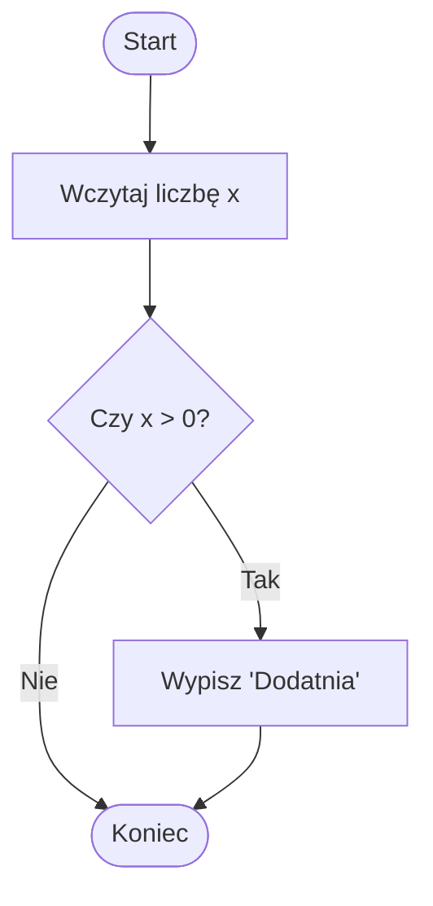
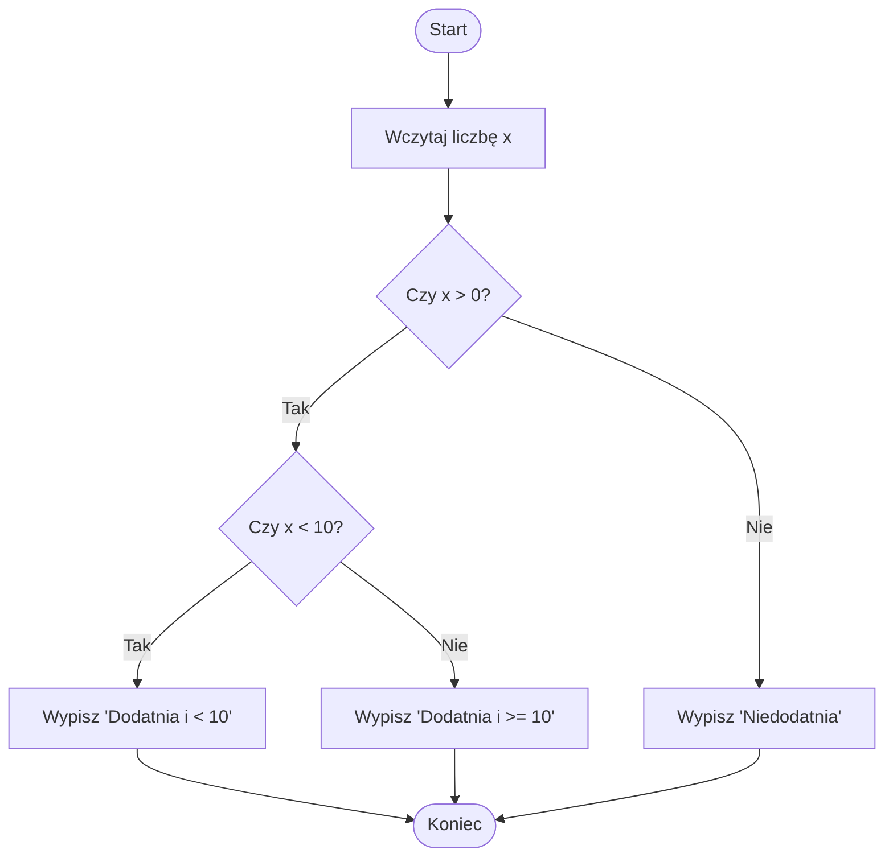
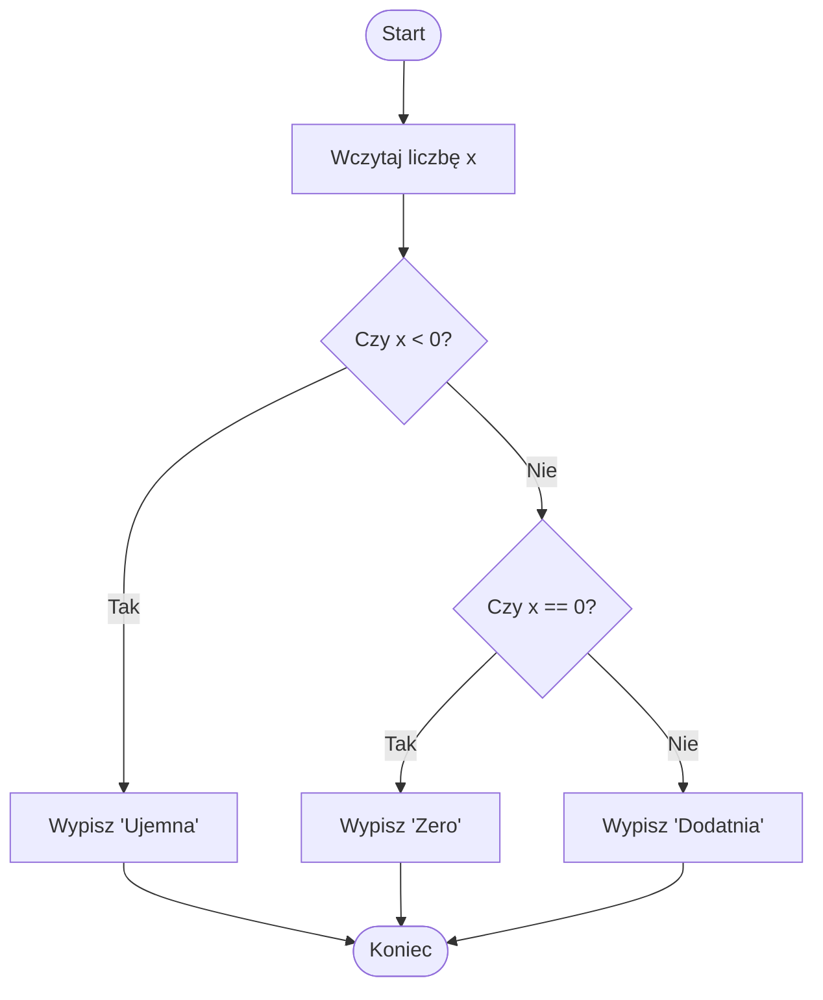
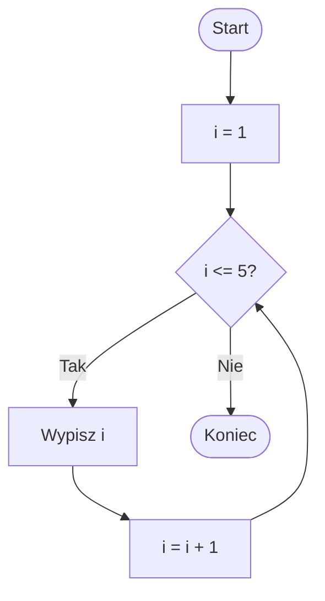
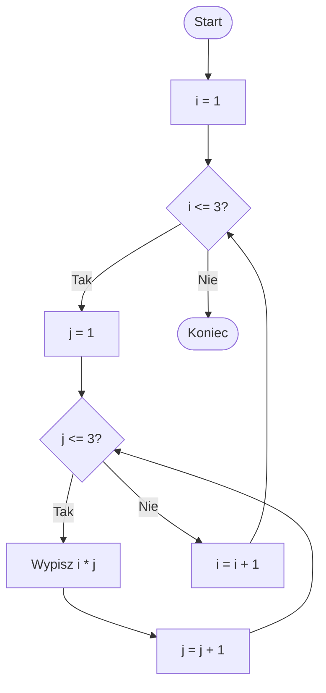

# Diagramy i kod w Pythonie

## 1. Instrukcja `if`

### Diagram


### Kod w Pythonie
```python
x = int(input("Podaj liczbę: "))
if x > 0:
    print("Dodatnia")
```

---

## 2. Zagnieżdżony `if`

### Diagram


### Kod w Pythonie
```python
x = int(input("Podaj liczbę: "))
if x > 0:
    if x < 10:
        print("Dodatnia i < 10")
    else:
        print("Dodatnia i >= 10")
else:
    print("Niedodatnia")
```

---

## 3. `if`, `elif`, `else`

### Diagram


### Kod w Pythonie
```python
x = int(input("Podaj liczbę: "))
if x < 0:
    print("Ujemna")
elif x == 0:
    print("Zero")
else:
    print("Dodatnia")
```

---

## 4. Pętla `while`

### Diagram


### Kod w Pythonie
```python
i = 1
while i <= 5:
    print(i)
    i += 1
```

---

## 5. Zagnieżdżona pętla

### Diagram


### Kod w Pythonie
```python
for i in range(1, 4):
    for j in range(1, 4):
        print(i, "*", j, "=", i * j)
```
