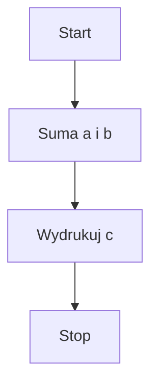

Na samym początku przydałoby się określić, czym jest to mistyczne programowanie i czy po napisaniu pierwszego programu możemy zacząć marzyć o zostaniu mitycznym #programista15k. Na drugie pytanie odpowiedź jest prosta – marzyć nikt nie zabrania. Na pierwsze jest bardziej złożona. Pojęcie programowania możemy zdefiniować jako proces tworzenia programu komputerowego przy użyciu **kodu źródłowego**, czyli kodu zrozumiałego dla człowieka, tłumaczonego przez komputer na **kod wynikowy** – binarny. Generalnie wyszukiwanie w internecie, czym jest programowanie może spowodować co najwyżej lekkie załamanie nerwowe, ale w skrócie chodzi o opracowanie zestawu poleceń dla komputera, które ten ma wykonać. Dla przykładu:

```c++
#include <iostream>

int main(){
    std::cout << "Hello World!" << endl;
    return 0;
}
```

Prosty, przykładowy kod w języku C++, który wydrukuje nam na terminalu „Hello World”. Taki kod sam w sobie nie spowoduje jednak magicznie wydrukowania zadanego tekstu na terminalu. Musi przejść jeszcze proces kompilacji, czyli przetłumaczenia kodu źródłowego na kod maszynowy. To dość duże uproszczenie, ale na ten moment w zupełności nam wystarczy. Warto po prostu wiedzieć, że to, co uruchamia komputer nie jest tak pięknym kawałkiem kodu jak to powyżej, tylko ciągiem zer i jedynek.

## To co można zaprogramować?
Wszystko, ale zaczniemy od absolutnych podstaw – zacząć programowanie należy bowiem od ustalenia, co i w jaki sposób komputer ma za nas zrealizować. Zatem najpierw wymyślimy algorytm, a następnie go zaimplementujemy. Nie znamy na razie zbyt wielu poleceń i pojęć, ale będziemy je sobie stopniowo wprowadzać. Zaczniemy od prostego dodawania a + b zapisanych w kodzie programu, a potem będziemy ten algorytm stopniowo rozwijać.



Nie jest to najbardziej złożony algorytm na świecie, nie jest też najlepszy. Można powiedzieć, że jako-taki, a i Mermaid.js, którego mam tu na stronie nie pozwala na rysowanie ładnych algorytmów, ale pozwoli jednak na wprowadzenie ważnego pojęcia, jakim jest zmienna.

```
Zmienna jest konstrukcją programistyczną posiadającą symboliczną nazwę, wartość i miejsce przechowywania
```

W kodzie źródłowym przy użyciu nazwy zmiennej możemy się odwołać zarówno do jej wartości jak i miejsca przechowywania – na ten moment interesować nas będzie jedynie wartość. Zmienna (w językach statycznie typowanych) ma również swój określony typ – wykorzystywany chociażby do kontroli, czy wszystkie dane są prawidłowe i czy przypadkiem w miejscu, w którym oczekiwalibyśmy liczby nie pojawił nam się magicznie tekst. W zaprezentowanym powyżej przykładzie zmiennymi będą zarówno a, b jak i c. Deklarowanie zmiennej w kodzie w języku C++ musi występować wraz z typem tej zmiennej. Alokuje to odpowiednią ilośc miejsca w pamięci komputera - dla przykładu typ int będzie zajmował więcej miejsca niż char.

## Wracając do programowania

Kod źródłowy, który zaraz napiszemy czytany i wykonywany będzie linijka po linijce, od góry do dołu, od lewej do prawej. To może być czasami nieoczywiste, im dalej w las tym łatwiej będzie się zgubić, ale taka prawidłowość będzie działać praktycznie zawsze. Większość środowisk od razu po stworzeniu nowego projektu zaserwuje nam przykładowy kod „Hello World”, przeanalizujemy go zatem:

```c++
#include <iostream>
```

Dyrektywa #include informuje preprocesor, aby w punkcie pojawienia się jej uwzględnił zawartość określonego pliku. W tym wypadku będzie to biblioteka iostream, która obsługuje strumień wejścia/wyjścia (i/o). Tak naprawdę to jedyne co preprocesor wykonuje, to wyszukanie zadanego pliku i zastąpienie jego zawartością podanej dyrektywy.

```c++
int main(){
```

main to główna funkcja programu. Jak każda funkcja ma zestaw argumentów zamknięty w nawiasach okrągłych – tu akurat tych argumentów nie ma, więc nawias jest pusty. Funkcja posiada również ciało, zawarte pomiędzy nawiasami klamrowymi ( { i } ).

```c++
std::cout<<”Hello World\n”;
```

Tu się dzieje trochę więcej. Zaczynając od tego std:: na początku na jakimś dziwnym „\n” kończąc. Zaczniemy od cout – z technicznego punktu widzenia jest to obiekt klasy ostream, zdefiniowany w pliku nagłówkowym iostream.

Z ludzkiego punktu widzenia – instrukcja wykorzystywana do wyświetlania danych wyjściowych na domyślnym urządzeniu wyjściowym – np. terminalu, drukarce. Zaraz dalej mamy dwa znaki mniejszości ( << ) – określa nam on, że element wypisany po nim ma być skierowany na domyślne wyjście.
To std:: przed rzeczonym cout oznacza, że jest to obiekt znajdujący się w przestrzeni nazw std. Jest to pozostałość po stworzeniu obiektowego języka C++, którego założeniem było zachowanie pełnej kompatybilności z czystym C.

„\n” jest znakiem końca linii – kursor przeskoczy na początek następnego wiersza.
Warto w tym miejscu zwrócić uwagę na kończący linię średnik – kończy on linię i niejako informuje kompilator, żeby poszedł dalej. Niektóre języki wykorzystują w tym celu znak nowej linii – jednak C, C++, Java i wiele innych opierać się będzie na średniku kończącym instrukcję. Średnik kończy tylko instrukcję – nie umieszczamy go na końcu funkcji – np. main.
return(0); - to polecenie sprawia, że funkcja main() zwraca wartość 0, co oznacza, że program skompilował (w zasadzie to wykonał) się pomyślnie. Jeśli z dowolnego powodu program nie jest w stanie dojść do tego momentu, a co za tym idzie zwrócić 0, to oznacza, że coś poszło nie tak.

} – zamknięcie funkcji main(). Więcej o funkcjach w najbliższym czasie.
Taki program możemy skompilować i uruchomić – powinno wydrukować się „Hello World” a program powinien się zakończyć automatycznie,

Przejdźmy do tych obliczeń i implementacji algorytmu, o którym wszyscy zdążyli już zapomnieć. Załóżmy, że a i b zdefiniujemy sobie na razie w kodzie. Celem programu jest policzenie i wydrukowanie wartości zmiennej c, która będzie wynikiem działania 𝑎 + 𝑏 = 𝑐
Zacząć należy od zadeklarowania zmiennych, aby komputer wiedział, jakiego są one typu, gdzie się one znajdują i jakie mają wartości.

```c++
int main(){
    int a = 21;
    int b = 37;
```

Zadeklarowaliśmy zmienne typu integer, czyli liczby całkowite. Do momentu ich nadpisania zmienna a będzie miała wartość 21, natomiast b będzie 37. Nie wydarzy się jednak sytuacja, w której a stanie się wartością „jajco” albo 12.34 – do końca życia programu będzie liczbą całkowitą – niekoniecznie o wartości 21 – to możemy bowiem później zmienić.

```c++ 
int c;
```

Poniżej deklarujemy zmienną typu całkowitego o nazwie c. Na razie jest ona pusta, za chwilę przypiszemy do niej wynik dodawania a i b.

```c++
c = a + b;
```

Po wykonaniu tej instrukcji zmienna c będzie miała wartość 58 (21 + 37). Pozostaje ją jedynie wypisać:

```c++
#include <iostream>
using namespace std;

int main(){
    int a = 21;
    int b = 37;
    int c;

    c = a + b;
    cout << "Wynik dodawania a+b" << c <<endl;
    return 0;
}
```

Program może zostać uproszczony na dwa sposoby: poprzez umieszczenie obliczenia w miejscu inicjalizacji zmiennej c:

```c++
int c = a+b;
```

lub poprzez całkowite ominięcie zmiennej c i obliczenie wyniku wprost przy wypisywaniu:

```c++
cout << "wynik a+b=" << a+b << endl;
```

## Operatory
W programowaniu rozróżniamy wiele operatorów, zarówno logicznych, jak i arytmetycznych.

| Operator  |  Wyrażenie    |   Wynik   |      Opis                 |
|-------------------------------|-----|-----|-----------------------|
| +                             | 5+7 | 12  | Dodawanie             |   
| -                             | 9-3 | 6   | Odejmowanie           |   
| *                             | 5*7 | 35  | Mnożenie              |   
| /                             | 4/2 | 2   | Dzielenie (całkowite) |   
| /                             | 5/2 | 2.5 | Dzielenie             |   
| %                             | 5%2 | 1   | Dzielenie z resztą    |       

## Typy zmiennych
Zmienne, jak już wcześniej wspomniałem, mogą mieć różne typy. Zależnie od przyjętego typu zmiennej, inaczej interpretowane będą zapisane w pamięci dane.
- char – typ znakowy, czyli pojedynczy znak ASCII, np. „F”
- int – liczba całkowita
- float – liczba zmiennoprzecinkowa
- double – liczba zmiennoprzecinkowa podwójnej precyzji
