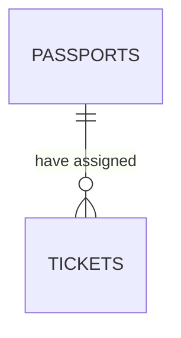

Na poprzednich zajęciach mieliście za zadanie zaprojektować bazę danych, jednak wtedy modelowaliśmy jedynie tabele oraz podstawowe relacje między nimi. Dziś zamodelujemy bazę danych z prawdziwego zdarzenia. 

## ERD - diagram związków encji
Z ang. Entity Relationship Diagram. Jest to graficzny sposób reprezentacji związków pomiędzy encjami. Na takim, w pełni poprawnie zbudowanym diagramie powinny znaleźć się **encje**, ich **atrybuty** oraz **związki** między nimi. 

### Encja
Określa różnego rodzaju obiekty lub wydarzenia. Na diagramach reprezentować ją będziemy prostokątem. Z technicznego punktu widzenia opisywać będziemy "magazyny danych", więc nazwę w takim prostokącie umieszczać będziemy u góry, stosując rzeczownik w liczbie mnogiej.

### Atrybut
Cecha charakterystyczna encji - w informatycznej implementacji pola. Określać je będziemy w kolejnych wierszach w ramach encji, zazwyczaj rzeczownikami w liczbie pojedynczej. Atrybuty stanowią składową opisu encji, w której jest umieszczany - np. numer siedzenia w samolocie raczej będzie atrybutem encji *miejsca*, a nie *bilet*. Specyficznym atrybutem będzie unikatowy **identyfikator**, czyli klucz główny, pozwalający na jednoznaczną identyfikację rekordu w bazie. Dopuszczalne są klucze główne łączone, jednak w praktyce, gdy nie mamy w tabeli pojedynczego pola pozwalającego na unikatową identyfikację wpisu w bazie, tworzyć będziemy dodatkowy atrybut, zwany **identyfikatorem sztucznym**, zazwyczaj pole **ID**

## Opcjonalność relacji
Relacje 1:1, 1:n, m:n mogą posiadać dodatkową cechę, czyli swoją opcjonalność. Określa ona minimalną liczebność relacji, 0 wystąpień lub 1 wystąpienie.

## Proces projektowania bazy danych
Cały proces projektowania bazy składa się z trzech podstawowych faz:
1. **Analiza wymagań** - proces obejmujący wywiad z udziałowcami, analizę wymagań biznesowych i zadań, jakie projektowana baza ma usprawnić/wprowadzić. Jest to proces niesformalizowany. Istnieją co prawda różne metody prowadzenia analizy, które pozwalają na określenie wymagań, ale nie istnieje jednoznaczna odpowiedź na pytanie "Jak prowadzić analizę wymagań"
2. **Realizacja koncepcyjnego modelu logicznego bazy danych** - etap, podczas którego na podstawie wcześniejszej analizy realizowany jest logiczny model bazy danych przy użyciu diagramu ERD. Na tym etapie modelowane będą wszystkie encje, atrybuty i związki. 
3. **Modelowanie fizycznego modelu i implementacja bazy** - etap, w którym tworzona będzie faktyczna baza danych.

Dziś zajmować się będziemy punktami 1 i 2. 

## Typy danych atrybutów
Każde pole w fizycznej relacyjnej bazie musi mieć swój typ danych. Rozróżniamy typy liczbowe, tekstowe i logiczne. Każdy silnik bazodanowy (RDBMS) ma sój określony zestaw dopuszczalnych typów, natomiast wszystkie będą miały pewien podstawowy zestaw:

- INT – liczba całkowita
- DATE/DATETIME – data/data+czas
- FLOAT – typ zmiennoprzecinkowy.
- BOOL – prawda/fałsz
- VARCHAR(100) – ciąg znaków o określonej maksymalnej długości 100 znaków