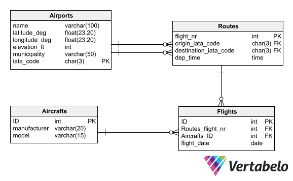

Poprzednio zaznajomiliśmy się z mechanizmami odpytywania bazy danych, ale pracowaliśmy jedynie na jednej, prostej tabeli z samochodami. Dziś pójdziemy o kroczek dalej i pracować będziemy na bazie, która składać się będzie z większej ilości tabel.

## Złączenia

Słówko kluczowe ```JOIN``` pozwoli nam na łączenie rekordów z wielu tabel na podstawie powiązanych kolumn. W przedstawionej poniżej bazie danych mamy 4 powiązane ze sobą tabele:



Do zaimportowania:
- [Airports.sql](../assets/RBD/Airports.sql)
- [Routes.sql](../assets/RBD/Routes.sql)
- [Flights.sql](../assets/RBD/Flights.sql)
- [Aircrafts.sql](../assets/RBD/Aircrafts.sql)

Joiny umożliwiają złączenie wierszy z jednej tabeli z wierszami z innej tabeli, w oparciu o określone kryteria zdefiniowane przez użytkownika. Dzięki temu można wykonać zapytanie, które pobierze dane z wielu tabel i połączy je w jedną relację.

Istnieją cztery rodzaje joinów w MySQL:

- Inner Join - wybiera tylko wiersze, które mają pasujące wartości w obu tabelach.
- Left Join - wybiera wszystkie wiersze z tabeli z lewej strony i dopasowuje pasujące wartości z tabeli z prawej strony. Jeśli nie ma dopasowania, to wartości dla kolumn z prawej strony będą równe NULL.
- Right Join - działa na podobnej zasadzie co Left Join, jednak zwraca wszystkie wiersze z tabeli z prawej strony i dopasowuje pasujące wartości z tabeli z lewej strony. Jeśli nie ma dopasowania, to wartości dla kolumn z lewej strony będą równe NULL.
- Full Outer Join - zwraca wszystkie wiersze z obu tabel, nawet jeśli nie ma dopasowania.
Do wykonania joina w MySQL można użyć polecenia SELECT z jednym lub więcej operatorami JOIN. Na przykład:

W powyższym przykładzie wspólnym kluczem dla tabel Routes i Flights będzie Routes.flight_nr i Flights.Routes_flight_nr, dlatego użyjemy go do połączenia rekordów z tych dwóch tabel

```sql
SELECT * FROM Routes JOIN Flights ON Routes.flight_nr = Flights.Routes_flight_nr
```

Takie zapytanie zwróci nam wszystkie rekordy, które mają pasujące do siebie wartości w obu tabelach, można powiedzieć, że "połączy" ze sobą powiązane rekordy, czyli do rekordu z tabeli Routes o flight_nr=1 dowiązane zostaną rekordy o ID 35 i 515 z tabeli Flights, ponieważ oba były wykonywane na linii o ID=1.

Powyższe zapytanie stworzy nam standardową tabelę wynikową, dlatego też bez najmniejszego problemu możemy w tym miejscu wykonywać dalsze, poznane wcześniej operacje (filtry, sortowanie itd.). Oczywiście JOIN wykonany może być również na większej liczbie tabel.

```sql
SELECT * FROM Routes JOIN Flights ON Routes.flight_nr = Flights.Routes_flight_nr JOIN Aircrafts A on A.ID = Flights.Aircrafts_ID WHERE Aircrafts_ID=7;
```

