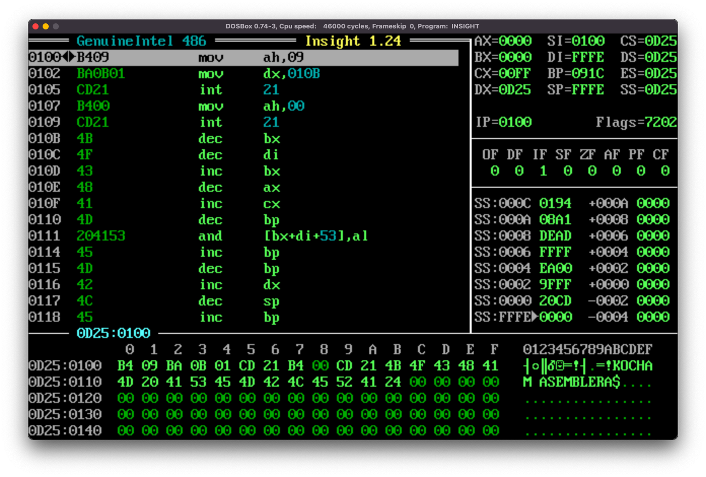

Podczas poprzedniego spotkania pracowaliśmy z przerwaniami, aby osiągnąć swoje cele, nawet jeśli naszym celem było wydrukowanie literki "A" w jakimś miejscu. Tej wiedzy nie zapominajmy, będzie dla nas bardzo przydatna w dalszej części przedmiotu, jednak dziś zajmować się będziemy tym, jak działa pamięć. Od strony teoretycznej ugryziemy ją jeszcze na wykładzie, teraz zajmiemy się praktyką. 

Temat nie jest tak zupełnie obcy, ponieważ na poprzednich zajęciach już jakieś dane, bezpośrednio w kodzie programu umieszczaliśmy - przy okazji wydruku stringa z przerwaniem [INT 21h/AH=09h](http://www.ctyme.com/intr/rb-2562.htm). String do wydruku musiał znaleźć się gdzieś w pamięci, a na ten adres musiał w momencie wywołania przerwania wskazywać rejestr DX

```nasm
org 100h

mov AH, 09h
mov DX, string
int 21h

mov AH, 00h
int 21h

string db "KOCHAM ASEMBLERA$"
```

Ten program uruchomiony w insighcie wygląda następująco:


Przenoszona do rejestru DX etykieta 'string' zamieniona została przez kompilator (technicznie, asembler) na adres pierwszego bajtu. Wszelkie podobieństwa do mechanizmu wskaźników są nieprzypadkowe. W taki sposób odczytujemy adres, na który wskazuje "wskaźnik", ale nie znamy wartości, która na tym adresie się znajduje - w powyższym przykładzie zawartość z pamięci odczytywana jest przez przerwanie.

Jeśli chcemy odczytać dane z pamięci skorzystać musimy z mechanizmu *adresowania pamięciowego*. Sposobów jest klika, ale mechanizm jest bardzo podobny do adresowania rejestrowego. W pewnym uproszczeniu, przy wykonywaniu operacji mov wartości podawane bez nawiasu kwadratowego traktowane będą po prostu jak liczby, natomiast umieszczenie dwubajtowej wartości w nawiasie kwadratowej spowoduje zajrzenie do pamięci pod wskazwywany przez podaną wartość adres i operację na najdujących się tam danych.

- adresowanie bezpośrednie - przeniesie do wskazanego miejsca zawartość ze wskazanego adresu. 
```nasm
mov AL, [0x1000]
```
    Zapisze do rejestru AL 8 bitów znajdujących się na adresie 0x1000
- adresowanie pośrednie - polega na podaniu adresu przechowywanego w rejestrze:
  ```nasm
mov AL, [BX]
```
    przeniesie do rejestru AL 8 bitów z adresu, który będzie wskazywany przez rejestr BX. Tu nadmienić należy, że spośród rejestrów ogólnego przeznaczenia (AX, BX, CX i DX), w nawiasie kwadratowym umieścić możemy w jedynie rejestr BX.
- adresowanie z przesunięciem - umożliwia odniesienie się do adresu przesuniętego względem rejestru:
    ```nasm
mov AL, [BX+3]
```
W poniższym kodzie znajdują się ważne przykłady zastosowania adresowania przy użyciu etykiet. Zachęcam do przetestowania osobiście i analizy przy użyciu insighta - w szczególności analizy, z jakich adresów w pamięci te dane się biorą - do tego trzeba zajrzeć na adres 0100h - kombinacja ```alt```+```D```

```nasm
org 100h

mov ax, litera        ; przeniesie do AX adres etykiety 'test' - adres literki A

mov ah, [litera]      ; przeniesie do AH 41h - ASCII litera 'A'
mov ax, [litera]      ; przeniesie do AX 6141h - ASCII litery 'Aa' - w odwrotnej kolejnosci

mov ah, [string]    ; przeniesie do AH 61h - ASCII litera 'a'
mov ax, [string]    ; przeniesie do AX 7361h - ASCII litery 'as'

mov ax, [string+3]  ; przeniesie do AX 626Dh - ASCII litery 'mb'

mov AH, 00h
int 21h

litera db 'A'
string db 'asembler jest super'
```

### Umieszczanie danych w pamięci
Odczyt danych to bardzo ważny aspekt, ale czymże byłby program ograniczony do przechowywania swoich danych na kilku rejestrach - oczywistym jest, że czasem pojawi się konieczność zapisania czegoś w pamięci. Nie jest to specjalnie trudne, jeśli pamiętamy, jak działa instrukcja mov:

```nasm
mov [cel], zrodlo
```

Zatem, dla przykładu, jeśli chcemy umieścić wartość 'A' pod adresem 0x0120:
```nasm
mov byte [0x0120], 'A'
```

Zasada działania z etykietami i rejestrem BX jest dokładnie taka sama jak w przypadku odczytu z pamięci, z tą różnicą, że wtedy były one źródłem danych, tu będą celem. 