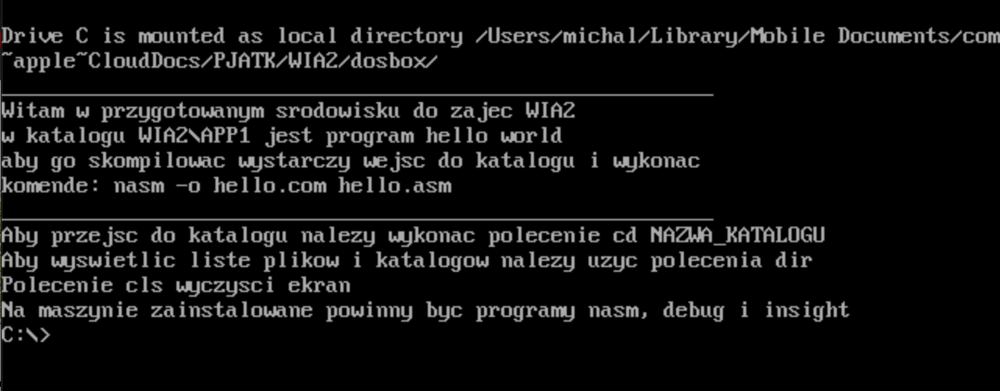

## Podstawy
1. Pobranie i instalacja DOSBoxa

   - Windows:
  [exe do pobrania](https://sourceforge.net/projects/dosbox/files/latest/download) 
   - Ubuntu:
   ```bash
   sudo apt install dosbox
   ```
   - MacOS:
   ```bash
   brew install dosbox
   ```
   - Na komputerach uczelnianych już jest zainstalowany

2. Pobrać należy:
   1. [dosbox.zip](../assets/RBD/WIA2/dosbox.zip) - obraz dysku
   2. [dosbox-0.74-3.conf](../assets/RBD/WIA2/dosbox-0.74-3.conf) - plik konfiguracyjny

3. Plik dosbox.zip proszę rozpakować i umieścić w dogodnym miejscu (na uczelni proponuję dysk Z:\\) oraz **skopiować ścieżkę rozpakowanego katalogu**. Proszę się upewnić, że kopiujecie ścieżkę do katalogu dosbox, który zawiera w sobie katalogi app i WIA2, a nie katalogu dosbox, który zawiera katalog dosbox. 

4. Następnie należy odpalić w dowolnym edytorze plik konfiguracyjny dosboxa:
   - Windows - Menu Windows -> DOSBox (Options)
   - Linux & MacOS - 
        ```bash
        dosbox -editconf nano
        ```
I podmienić znajdującą się tam treść z treścią pobranego pliku dosbox-0.74-4.conf

5. W trzeciej od końca linii tego pliku należy umieścić ścieżkę wspomnianego w pkt 3. katalogu dosbox.
6. Po uruchomieniu DOSBoxa zobaczyć powinniśmy to:
   
   