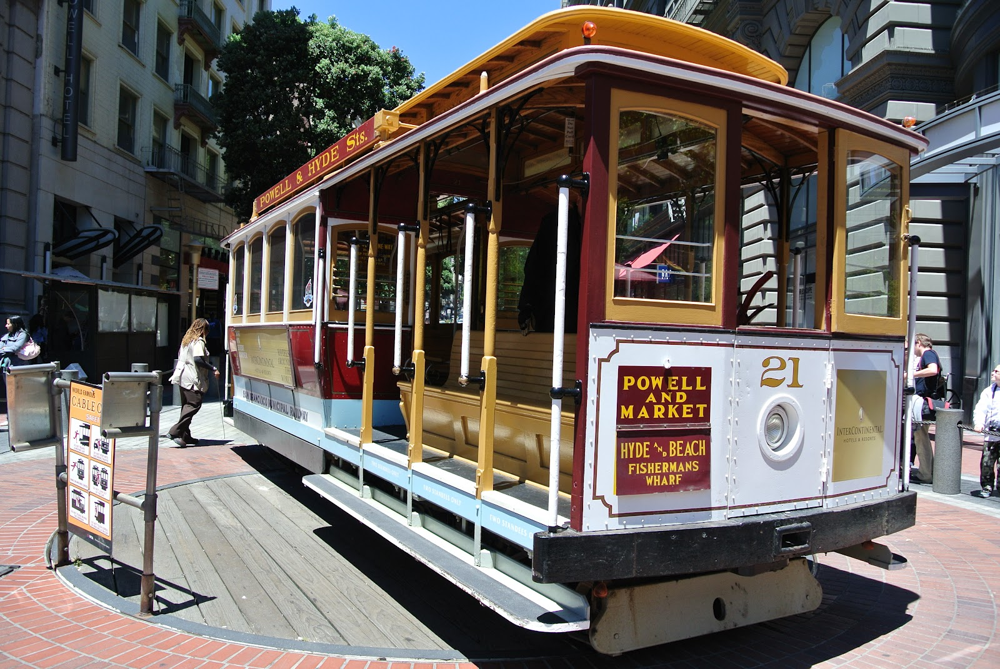
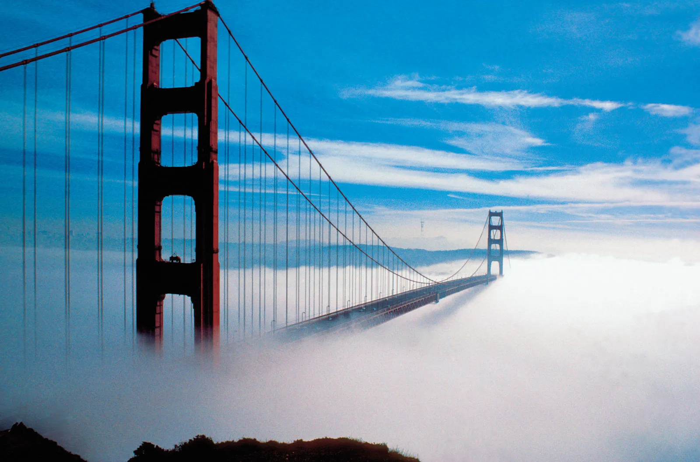
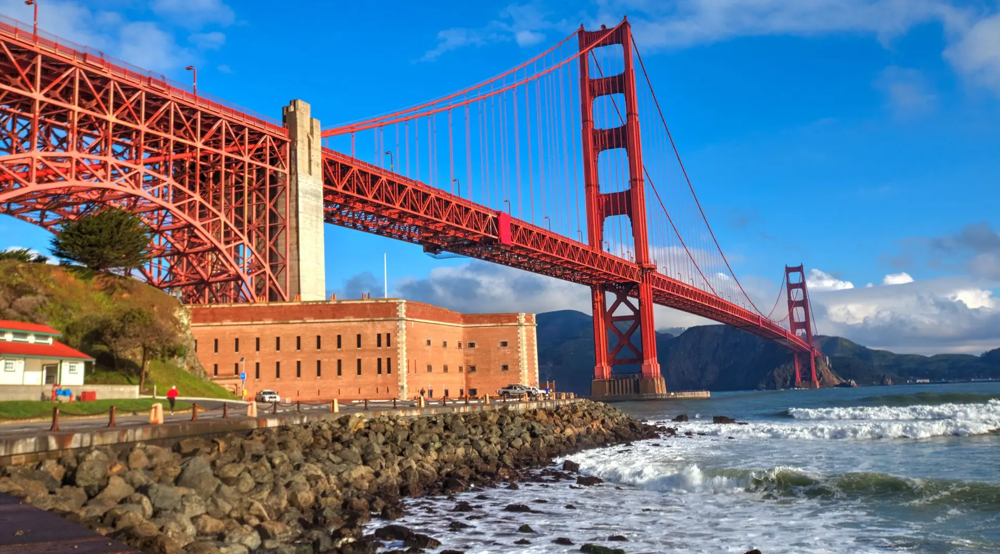
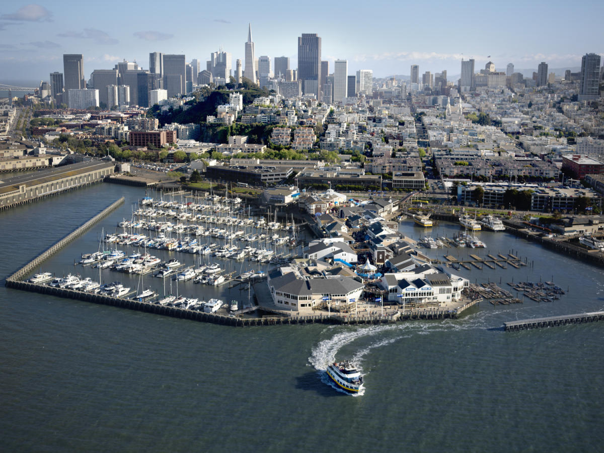
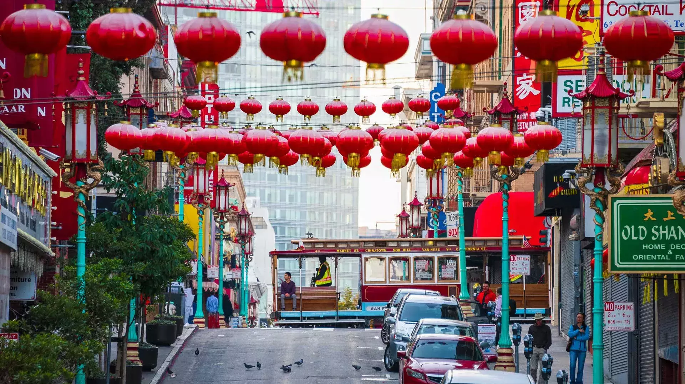
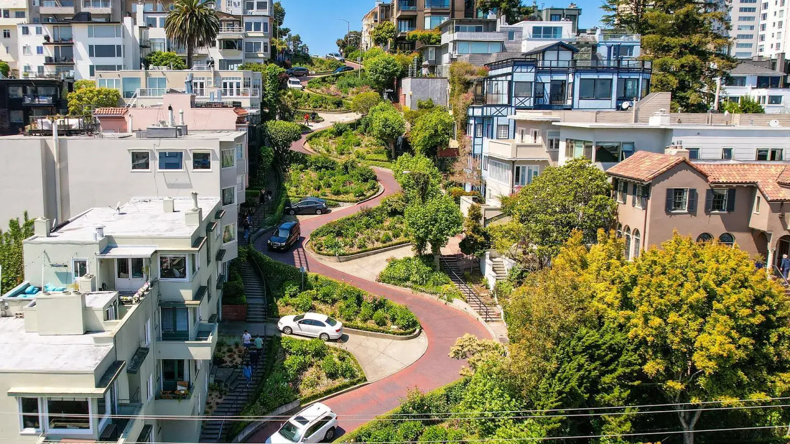
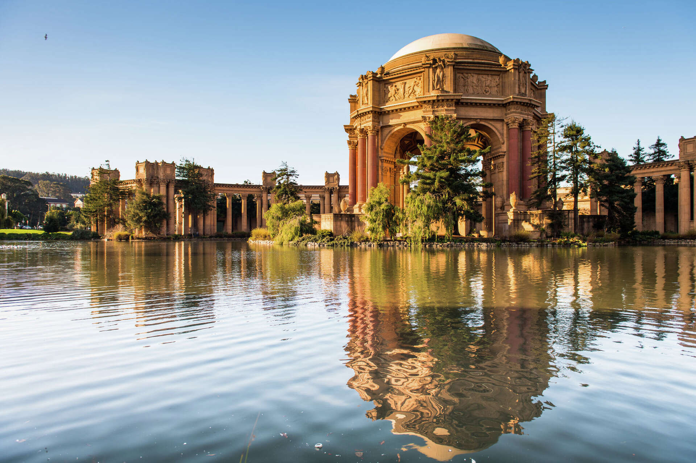
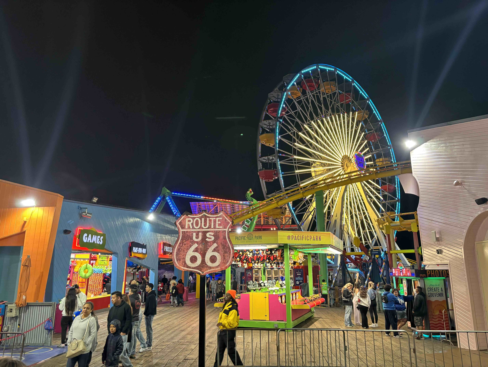
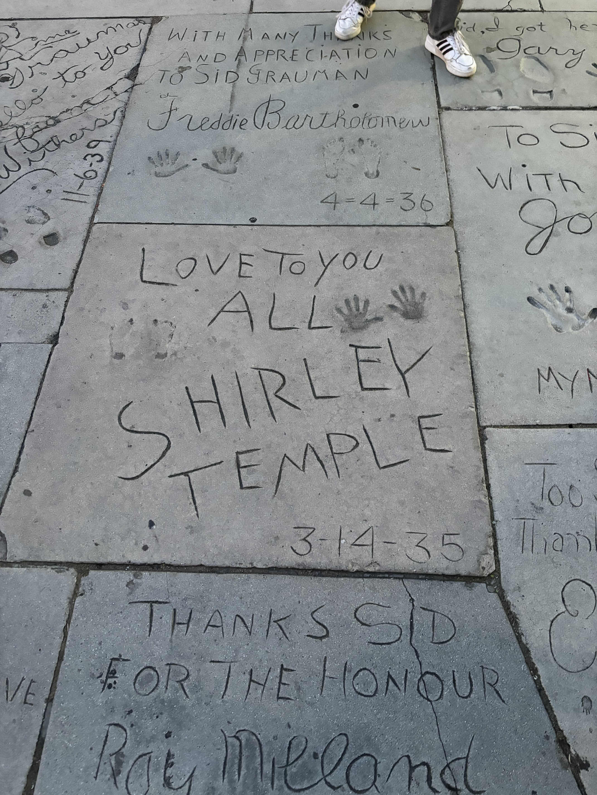

Choć do wyjazdu pozostało nam jeszcze trochę czasu, to zakup biletów będzie musiał się wydarzyć już zaraz. Abyśmy wiedzieli, skąd będziemy wracać chcielibyśmy abyście wszyscy podjęli świadomy wybór nt. tego, w jakim mieście zakończymy naszą wycieczkę. Abyśmy mieli przekonanie, że wasz wybór będzie świadomy i poinformowany, przygotowałem krótki opis z poglądowymi zdjęciami tego, czego możemy spodziewać się po obu potencjalnych destynacjach. Ceny lotów różnią się pomiędzy destynacjami marginalnie, a jeśli któryś jest droższy, to offsetuje się tańszym zwrotem samochodu, więc decyzja jest w waszych rękach. Temat pozostawiam pod dyskusję, fajnie będzie niezależnie, gdzie pojedziemy. Demokracja zdecyduje. 

## Opcja 1: San Francisco
Miasto, które wyrosło z niewielkiej osady portowej na jeden z symboli amerykańskiej potęgi. W 1776 na północnym krańcu półwyspu Imperium Hiszpańskie zbudowało *presidio*, czyli fortyfikację kontrolującą dostęp do zatoki *San Francisco*. Wielki skok rozwojowy miasto zawdzięcza gorączce złota z 1848 roku, kiedy do Kaliforni ruszyły setki tysięcy ludzi. 

Miasto kojarzone jest również z **trzęsieniami ziemi**, które je regularnie nawiedzają - przede wszystkim jednak z niszczycielskim trzęsieniem z 18 kwietnia 1906 roku, które zniszczyło blisko **80% miasta**. Dziś przyciąga nie tylko swoją historią, ale też wyjątkowym położeniem, atmosferą i widokami, które sprawiają, że jest jednym z najbardziej charakterystycznych miast USA.

Plan zwiedzania zakłada przede wszystkim odwiedzenie najbardziej ikonicznych landmarków miasta - skąpanego we mgle **Mostu Golden Gate**, **Parku Presidio**, czyli nigdysiejszej bazy wojskowej, **Palace of Fine Arts**, czy przejazd przez legendarną **Lombard Street**. Przespacerujemy się po **Fisherman's Wharf / Pier 39**. Odwiedzimy ikoniczne **Chinatown** oraz przejedziemy się historycznym **Cable Car** po stromych ulicach miasta. 

  

    <figure class="holiday-card">
      <button class="holiday-card__button" type="button" data-full="../assets/Odyseja/2k26/SF/DSC_0275.JPG" aria-label="Otworz zdjecie San Francisco 1 w pelnym rozmiarze">
        
      </button>
      <figcaption>San Francisco 1</figcaption>
    </figure>
    <figure class="holiday-card">
      <button class="holiday-card__button" type="button" data-full="../assets/Odyseja/2k26/SF/Fog-Golden-Gate-Bridge-entrance-California-San.jpg.webp" aria-label="Otworz zdjecie San Francisco 2 w pelnym rozmiarze">
        
      </button>
      <figcaption>San Francisco - Golden Gate Bridge</figcaption>
    </figure>
    <figure class="holiday-card">
      <button class="holiday-card__button" type="button" data-full="../assets/Odyseja/2k26/SF/Fort-Point_MG_7723-e1691100437614.webp" aria-label="Otworz zdjecie San Francisco 3 w pelnym rozmiarze">
        
      </button>
      <figcaption>San Francisco - Fort Point</figcaption>
    </figure>
    <figure class="holiday-card">
      <button class="holiday-card__button" type="button" data-full="../assets/Odyseja/2k26/SF/Pier_39_Skyline_127c45e9-c5fc-482c-aed9-d0bbc2c028a0.jpg" aria-label="Otworz zdjecie San Francisco 4 w pelnym rozmiarze">
        
      </button>
      <figcaption>San Francisco - Pier 39</figcaption>
    </figure>
    <figure class="holiday-card">
      <button class="holiday-card__button" type="button" data-full="../assets/Odyseja/2k26/SF/chinatown-cable-car.jpg.webp" aria-label="Otworz zdjecie San Francisco 5 w pelnym rozmiarze">
        
      </button>
      <figcaption>San Francisco - Chinatown i Cable Car</figcaption>
    </figure>
    <figure class="holiday-card">
      <button class="holiday-card__button" type="button" data-full="../assets/Odyseja/2k26/SF/lombard-street-aerial.jpg.webp" aria-label="Otworz zdjecie San Francisco 6 w pelnym rozmiarze">
        
      </button>
      <figcaption>San Francisco - Lombard Street</figcaption>
    </figure>
    <figure class="holiday-card">
      <button class="holiday-card__button" type="button" data-full="../assets/Odyseja/2k26/SF/ratio3x2_1920.jpg" aria-label="Otworz zdjecie San Francisco 7 w pelnym rozmiarze">
        
      </button>
      <figcaption>San Francisco 7</figcaption>
    </figure>
  

## Opcja 2: Los Angeles
Miasto, którego początki sięgają 1781 roku, kiedy Hiszpanie założyli tu osadę o nazwie *El Pueblo de Nuestra Señora la Reina de los Ángeles de Porciúncula*. Z czasem niewielkie pueblo rozrosło się w jedną z największych metropolii Stanów Zjednoczonych — symbol amerykańskiego przemysłu filmowego, kultury popularnej i zachodniego wybrzeża.

Dziś Los Angeles jest miastem o zupełnie innym charakterze niż San Francisco — mniej zwartym i „pocztówkowym”, a bardziej rozległym, samochodowym i opartym na pojedynczych, bardzo rozpoznawalnych miejscach poprzecinanymi rozległymi osiedlami i autostradami. To właśnie tu najmocniej czuć klimat Hollywood, kalifornijskich plaż, palm i wielkiej metropolii rozlanej między wzgórzami a oceanem. Miasto pozostaje jednym z najważniejszych symboli amerykańskiej kultury masowej i przemysłu rozrywkowego.

Plan zwiedzania zakłada przede wszystkim odwiedzenie najbardziej charakterystycznych punktów miasta — **Griffith Observatory**, skąd rozciąga się świetny widok na panoramę Los Angeles i **okolice napisu Hollywood**, następnie przejazd przez bardziej znane rejony, takie jak **Hollywood Blvd** z **TCL Chinese Theatre** z odciskami stóp legend kina, czy **Beverly Hills**, wypad nad ocean, najlepiej w okolice **Santa Monica Pier** i plaży. Zobaczyć możemy również **Venice Beach** i legendarny skatepark.

  

    <figure class="holiday-card">
      <button class="holiday-card__button" type="button" data-full="../assets/Odyseja/2k26/LA/IMG_2709.jpg" aria-label="Otworz zdjecie Los Angeles 1 w pelnym rozmiarze">
        
      </button>
      <figcaption>Los Angeles 1</figcaption>
    </figure>
    <figure class="holiday-card">
      <button class="holiday-card__button" type="button" data-full="../assets/Odyseja/2k26/LA/IMG_2724.jpg" aria-label="Otworz zdjecie Los Angeles 2 w pelnym rozmiarze">
        
      </button>
      <figcaption>Los Angeles 2</figcaption>
    </figure>
    <figure class="holiday-card">
      <button class="holiday-card__button" type="button" data-full="../assets/Odyseja/2k26/LA/IMG_2743.jpg" aria-label="Otworz zdjecie Los Angeles 3 w pelnym rozmiarze">
        
      </button>
      <figcaption>Los Angeles 3</figcaption>
    </figure>
    <figure class="holiday-card">
      <button class="holiday-card__button" type="button" data-full="../assets/Odyseja/2k26/LA/IMG_2750.jpg" aria-label="Otworz zdjecie Los Angeles 4 w pelnym rozmiarze">
        
      </button>
      <figcaption>Los Angeles 4</figcaption>
    </figure>
    <figure class="holiday-card">
      <button class="holiday-card__button" type="button" data-full="../assets/Odyseja/2k26/LA/TCL-Chinese-Theatre-IMAX-Exterior.jpg.avif" aria-label="Otworz zdjecie Los Angeles 5 w pelnym rozmiarze">
        
      </button>
      <figcaption>Los Angeles - TCL Chinese Theatre</figcaption>
    </figure>
    <figure class="holiday-card">
      <button class="holiday-card__button" type="button" data-full="../assets/Odyseja/2k26/LA/llegando-observatorio-griffith.jpg.avif" aria-label="Otworz zdjecie Los Angeles 6 w pelnym rozmiarze">
        
      </button>
      <figcaption>Los Angeles - Griffith Observatory</figcaption>
    </figure>
  

  

  

    

      <button class="holiday-lightbox__nav" type="button" data-nav="prev" aria-label="Poprzednie zdjecie">Wstecz</button>
      

      <button class="holiday-lightbox__close" type="button" data-close="true" aria-label="Zamknij podglad">Zamknij</button>
      <button class="holiday-lightbox__nav" type="button" data-nav="next" aria-label="Nastepne zdjecie">Dalej</button>
    

    
  

