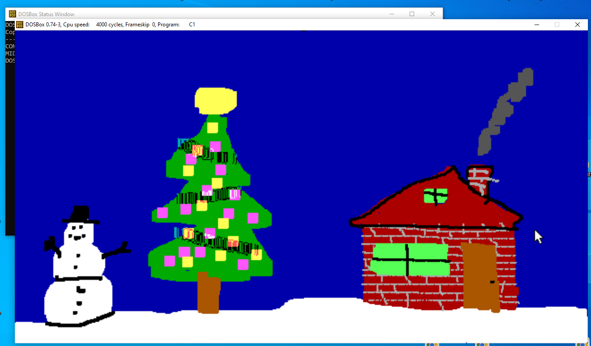
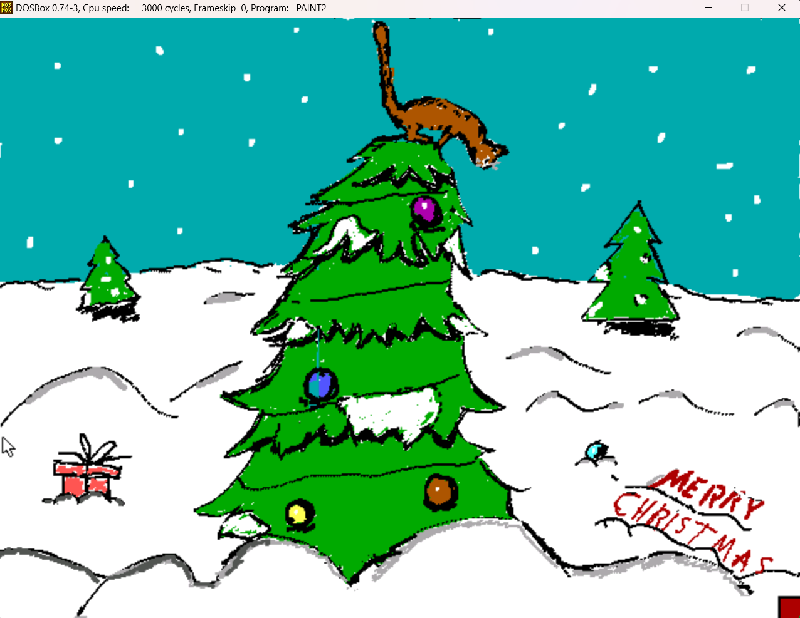
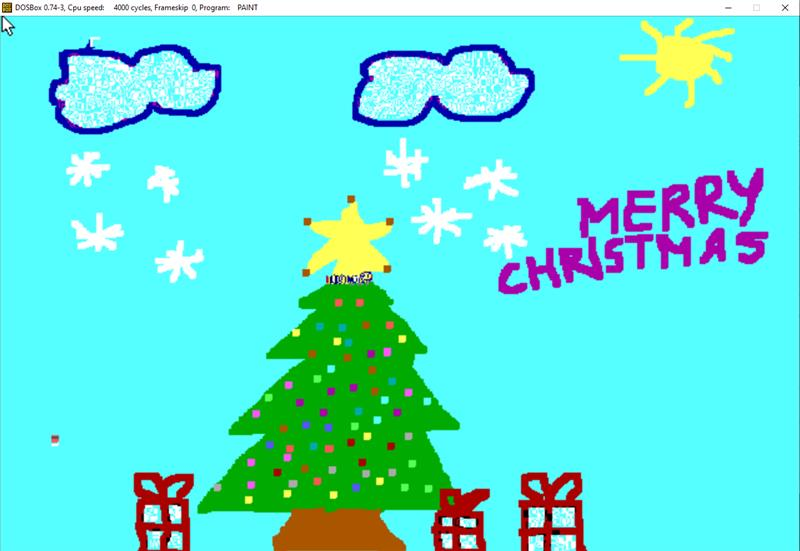

# Galeria Sztuki Swiatecznej 2024

  

    <figure class="holiday-card">
      <button class="holiday-card__button" type="button" data-full="../assets/WIA2/cards/christmas.png" aria-label="Otworz kartke 1 w pelnym rozmiarze">
        
      </button>
      <figcaption>Kartka 1</figcaption>
    </figure>
    <figure class="holiday-card">
      <button class="holiday-card__button" type="button" data-full="../assets/WIA2/cards/ChristmasCard.png" aria-label="Otworz kartke 2 w pelnym rozmiarze">
        
      </button>
      <figcaption>Kartka 2</figcaption>
    </figure>
    <figure class="holiday-card">
      <button class="holiday-card__button" type="button" data-full="../assets/WIA2/cards/image.png" aria-label="Otworz kartke 3 w pelnym rozmiarze">
        
      </button>
      <figcaption>Kartka 3</figcaption>
    </figure>
    <figure class="holiday-card">
      <button class="holiday-card__button" type="button" data-full="../assets/WIA2/cards/image-2.png" aria-label="Otworz kartke 4 w pelnym rozmiarze">
        
      </button>
      <figcaption>Kartka 4</figcaption>
    </figure>
    <figure class="holiday-card">
      <button class="holiday-card__button" type="button" data-full="../assets/WIA2/cards/image-3.png" aria-label="Otworz kartke 5 w pelnym rozmiarze">
        
      </button>
      <figcaption>Kartka 5</figcaption>
    </figure>
    <figure class="holiday-card">
      <button class="holiday-card__button" type="button" data-full="../assets/WIA2/cards/image-4.png" aria-label="Otworz kartke 6 w pelnym rozmiarze">
        
      </button>
      <figcaption>Kartka 6</figcaption>
    </figure>
    <figure class="holiday-card">
      <button class="holiday-card__button" type="button" data-full="../assets/WIA2/cards/kartka_świąteczna-Jakub_Stramski_s30285.png" aria-label="Otworz kartke 7 w pelnym rozmiarze">
        
      </button>
      <figcaption>Kartka 7</figcaption>
    </figure>
    <figure class="holiday-card">
      <button class="holiday-card__button" type="button" data-full="../assets/WIA2/cards/Screenshot%202024-12-16%20223045.png" aria-label="Otworz kartke 8 w pelnym rozmiarze">
        
      </button>
      <figcaption>Kartka 8</figcaption>
    </figure>
    <figure class="holiday-card">
      <button class="holiday-card__button" type="button" data-full="../assets/WIA2/cards/shrek.PNG" aria-label="Otworz kartke 9 w pelnym rozmiarze">
        
      </button>
      <figcaption>Kartka 9</figcaption>
    </figure>
    <figure class="holiday-card">
      <button class="holiday-card__button" type="button" data-full="../assets/WIA2/cards/kartka_świąteczno-magistralna.png" aria-label="Otworz kartke 10 w pelnym rozmiarze">
        
      </button>
      <figcaption>Kartka 10</figcaption>
    </figure>
    <figure class="holiday-card">
      <button class="holiday-card__button" type="button" data-full="../assets/WIA2/cards/obraz.png" aria-label="Otworz kartke 11 w pelnym rozmiarze">
        
      </button>
      <figcaption>Kartka 11</figcaption>
    </figure>
    <figure class="holiday-card">
      <button class="holiday-card__button" type="button" data-full="../assets/WIA2/cards/Zrzut%20ekranu%202024-12-17%20130403.png" aria-label="Otworz kartke 12 w pelnym rozmiarze">
        
      </button>
      <figcaption>Kartka 12</figcaption>
    </figure>
    <figure class="holiday-card">
      <button class="holiday-card__button" type="button" data-full="../assets/WIA2/cards/wersja1.png" aria-label="Otworz kartke 13 w pelnym rozmiarze">
        
      </button>
      <figcaption>Kartka 13</figcaption>
    </figure>
    <figure class="holiday-card">
      <button class="holiday-card__button" type="button" data-full="../assets/WIA2/cards/image%202.png" aria-label="Otworz kartke 14 w pelnym rozmiarze">
        
      </button>
      <figcaption>Kartka 14</figcaption>
    </figure>
    <figure class="holiday-card">
      <button class="holiday-card__button" type="button" data-full="../assets/WIA2/cards/piotr_bogdanowicz_wesolych.png" aria-label="Otworz kartke 15 w pelnym rozmiarze">
        
      </button>
      <figcaption>Kartka 15</figcaption>
    </figure>
    <figure class="holiday-card">
      <button class="holiday-card__button" type="button" data-full="../assets/WIA2/cards/kartka.png" aria-label="Otworz kartke 16 w pelnym rozmiarze">
        
      </button>
      <figcaption>Kartka 16</figcaption>
    </figure>
    <figure class="holiday-card">
      <button class="holiday-card__button" type="button" data-full="../assets/WIA2/cards/obraz_2024-12-16_214958514.png" aria-label="Otworz kartke 17 w pelnym rozmiarze">
        
      </button>
      <figcaption>Kartka 17</figcaption>
    </figure>
    <figure class="holiday-card">
      <button class="holiday-card__button" type="button" data-full="../assets/WIA2/cards/GRINCH.PNG" aria-label="Otworz kartke 18 w pelnym rozmiarze">
        
      </button>
      <figcaption>Kartka 18</figcaption>
    </figure>
    <figure class="holiday-card">
      <button class="holiday-card__button" type="button" data-full="../assets/WIA2/cards/Zrzut%20ekranu%202024-12-18%20o%2010.54.05.png" aria-label="Otworz kartke 19 w pelnym rozmiarze">
        
      </button>
      <figcaption>Kartka 19</figcaption>
    </figure>
    <figure class="holiday-card">
      <button class="holiday-card__button" type="button" data-full="../assets/WIA2/cards/Kartka_Mateusz_K_s27811.png" aria-label="Otworz kartke 20 w pelnym rozmiarze">
        
      </button>
      <figcaption>Kartka 20</figcaption>
    </figure>
    <figure class="holiday-card">
      <button class="holiday-card__button" type="button" data-full="../assets/WIA2/cards/kartka-2.png" aria-label="Otworz kartke 21 w pelnym rozmiarze">
        
      </button>
      <figcaption>Kartka 21</figcaption>
    </figure>
    <figure class="holiday-card">
      <button class="holiday-card__button" type="button" data-full="../assets/WIA2/cards/76d9c214-c474-4439-a4c4-6d68ae711f53.jpg" aria-label="Otworz kartke 22 w pelnym rozmiarze">
        
      </button>
      <figcaption>Kartka 22</figcaption>
    </figure>
  

Aktualna edycja: <a href="/galeria">Galeria Sztuki Swiatecznej 2025</a>

  

  

    

      <button class="holiday-lightbox__nav" type="button" data-nav="prev" aria-label="Poprzednia kartka">Wstecz</button>
      

      <button class="holiday-lightbox__close" type="button" data-close="true" aria-label="Zamknij podglad">Zamknij</button>
      <button class="holiday-lightbox__nav" type="button" data-nav="next" aria-label="Nastepna kartka">Dalej</button>
    

    
  

