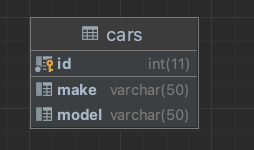

## Kolokwium RBD, część 1

1. Co to jest klucz podstawowy (primary key) w bazie danych?
[ ] Unikalny identyfikator rekordu w tabeli
[ ] Kolumna, która przechowuje indeksy rekordów
[ ] Typ danych używany do przechowywania danych w tabeli

2. Jakie są typy związków między tabelami w bazach danych?
[ ] Jeden do jednego (1:1), jeden do wielu (1:N), wiele do wielu (N:N)
[ ] Pionowy, poziomy, diagonalny
[ ] Prosty, złożony, wielopoziomowy

3. Co to jest zapytanie SQL SELECT?
[ ] Zapytanie używane do tworzenia nowej tabeli
[ ] Zapytanie używane do dodawania danych do tabeli
[ ] Zapytanie używane do pobierania danych z tabeli

4. Jakie są podstawowe operatory porównania w zapytaniach SQL?
[ ] +, -, *, /
[ ] AND, OR, NOT
[ ] =, <, >, <=, >=, <>

5. Co to jest widok (view) w bazie danych?
[ ] Tymczasowa tabela, która przechowuje wyniki zapytania
[ ] Kolumna, która jest ukryta przed użytkownikami
[ ] Przedstawienie częściowej struktury danych dla wygodnego dostępu

6. Co to jest klucz obcy (foreign key) w bazie danych?
[ ] Kolumna zawierająca indeksy rekordów
[ ] Kolumna, która łączy dwie tabele na podstawie wspólnego atrybutu
[ ] Kolumna, która przechowuje wartości unikalne w tabeli

7. Jakie są podstawowe operatory logiczne w zapytaniach SQL?
[ ] AND, OR, NOT
[ ] +, -, *
[ ] >, <, =

8. Co to jest klauzula WHERE w zapytaniach SQL?
[ ] Klauzula używana do sortowania wyników zapytania
[ ] Klauzula używana do określenia warunków filtrowania danych w zapytaniu
[ ] Klauzula używana do łączenia danych z różnych tabel

9. Które zapytanie SQL posłuży do wyciągnięcia wszystkich rekordów o ID od 1 do 10?
[ ] `SELECT * FROM table WHERE id BETWEEN 1 AND 10;`
[ ] `SELECT id FROM table BETWEEN 1 AND 10;`
[ ] `SELECT * FROM table WHERE id IN (1, 10);`

10. Ile wierszy zwróci zapytanie `SELECT MAX(price) FROM cars;`? (zakładając ze w bazie coś jest)
[ ] 1
[ ] 2
[ ] 0

11. W jaki sposób można wprowadzić nowy rekord do powyższej tabeli?
[ ] INSERT INTO cars VALUES (1, Citroen, C4);
[ ] INSERT INTO cars (id, make, model) VALUES (1, Citroen, C4);
[ ] INSERT INTO cars VALUES (1, 'Citroen', 'C4');

## Kolokwium RBD, część 2 

1. Zaproponuj diagram ERD dla wypożyczalni samochodów. Interesują nas informacje o pracownikach, klientach, samochodach o wypożyczeniach. Wypożyczenie musi mieć swoją datę i godzinę startu i zakończenia oraz pracownika wydającego i odbierającego samochód. Powinniśmy być na tej bazie w stanie ustalić ile konkretny klient wydał na wszystkie swoje rezerwacje.